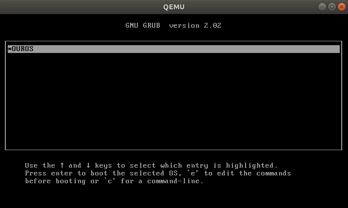
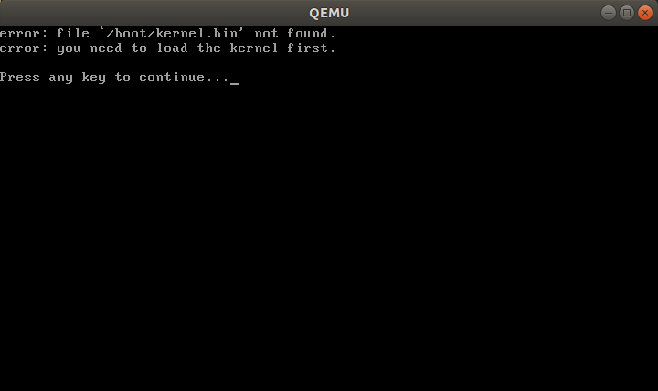
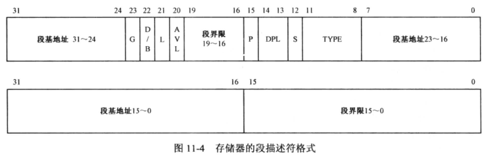
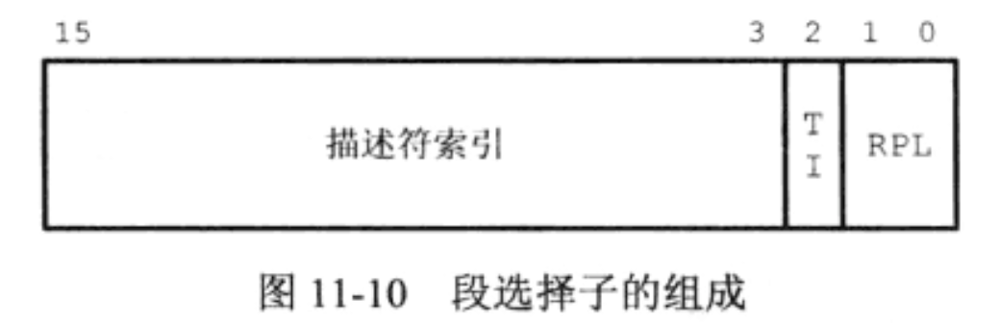
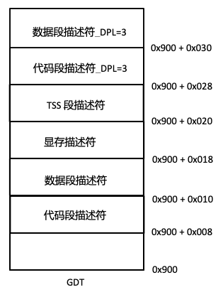
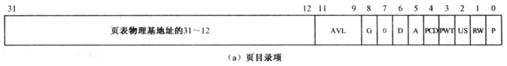
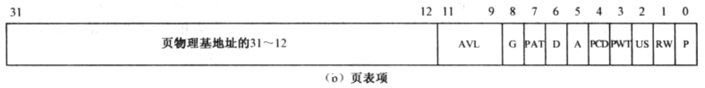
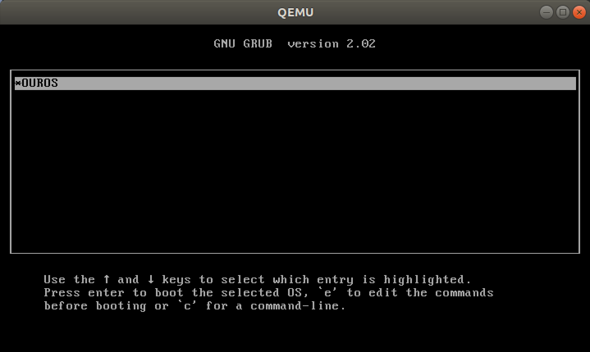
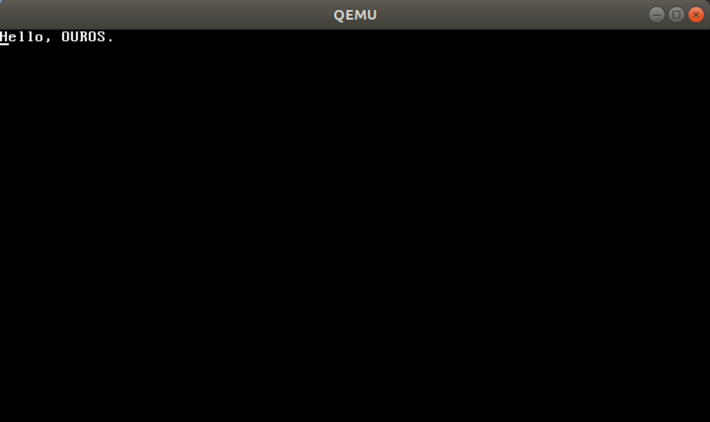

# OUROS 启动部分

> 开发环境：
>
> 编译器：gcc version 7.5.0 (Ubuntu 7.5.0-3ubuntu1~18.04)
>
> 链接器：GNU ld (GNU Binutils for Ubuntu) 2.30
>
> 虚拟机：QEMU emulator version 2.11.1(Debian 1:2.11+dfsg-1ubuntu7.39)

## 1 从启动到 GRUB

> https://www.binss.me/blog/boot-process-of-linux-grub/

### 1.1 第一条指令

一般来说，在接通电源时，主板就已经部分通电了。其处于 Standby 模式，检测是否需要开机。当用户按下电源开关(开机键)后，电源开始进入正常工作模式，它会给主板上电，按照时序供应 5V 和 12V 电源，然后输出 Power_OK 信号，通知主板可以正式工作。最后，主板会向 CPU 的 reset 引脚发送信号，于是CPU将清除所有寄存器中的数据并加载为预设值，根据 Intel SDM vol3 Table 9-1，寄存器值为：

```text
EIP          0000FFF0H
CS Selector  F000H
CS base      FFFF0000H
CS Limit     FFFFH
```

可以发现此时 CS 为 0xf000 ， IP 为 0xfff0 。根据 real mode 下地址的计算方法，此时 CS base 应该等于 0xf000 << 4 = 0xf0000 。但为何 Intel SDM 中说它是 0xffff0000 呢？根据 Intel SDM vol3 9.1.4 First Instruction Executed ：

> The address FFFFFFF0H is beyond the 1-MByte addressable range of the processor while in real-address mode. The processor is initialized to this starting address as follows. The CS register has two parts: the visible segment selector part and the hidden base address part. In real-address mode, the base address is normally formed by shifting the 16-bit segment selector value 4 bits to the left to produce a 20-bit base address. However, during a hardware reset, the segment selector in the CS register is loaded with F000H and the base address is loaded with FFFF0000H. The starting address is thus formed by adding the base address to the value in the EIP register (that is, FFFF0000 + FFF0H = FFFFFFF0H).

即段寄存器有一个隐藏的base address部分(不属于寄存器，而是位于一片非一致性cache中)，在 reset 的时候被设置成 0xffff0000 。因此我们需要使用的是这个隐藏的 base address 而不是我们计算得到的 0f0000。

因此实际上执行的第一条指令的地址为 0xffff0000 + 0xfff0 = 0xfffffff0

查看这个地址，一般都是跳转：

```text
(gdb) set architecture i8086
(gdb) x/i 0xfffffff0
   0xfffffff0:  ljmp   $0xf000,$0xe05b
```

但有趣的是查看 0xffff0(0xf0000 + 0xffff) 也是同样的内容：

```text
(gdb) x/i 0xffff0
   0xffff0: ljmp   $0xf000,$0xe05b
```

根据一些资料，这是一项称为 Shadow RAM 的技术在作怪，它将BIOS ROM中的内容映射到RAM中，以提升访问速度。因此 0xf0000 - 0xfffff 和 0xffff0000 - 0xffffffff 映射的是同一片ROM，自然存在 0xfffffff0 的指令就和存在 0xffff0 的指令相同了。

### 1.2 第二条指令

`ljmp $0xf000,$0xe05b` 是一条长跳转指令，目标地址为 `0xf000:0xe05b` 。

于是此时 cs 被加载为 0xf000 ，此后 base address 将遵循 real mode 下的基地址计算方法，等于 0xf000 << 4 = 0xf0000 。

根据 IBM PC compatible PC 规定的内存布局：

```text
+------------------+  <- 0xFFFFFFFF (4GB)
|      32-bit      |
|  memory mapped   |
|     devices      |
|                  |
/\/\/\/\/\/\/\/\/\/\

/\/\/\/\/\/\/\/\/\/\
|                  |
|      Unused      |
|                  |
+------------------+  <- depends on amount of RAM
|                  |
|                  |
| Extended Memory  |
|                  |
|                  |
+------------------+  <- 0x00100000 (1MB)
|     BIOS ROM     |
+------------------+  <- 0x000F0000 (960KB)
|  16-bit devices, |
|  expansion ROMs  |
+------------------+  <- 0x000C0000 (768KB)
|   VGA Display    |
+------------------+  <- 0x000A0000 (640KB)
|                  |
|    Low Memory    |
|                  |
+------------------+  <- 0x00000000
```

可以发现起始阶段的内存地址空间主要在于前 1MB，其中 Low Memory (0-640KB) 为起始阶段能够使用的内存。0x000a0000 - 0x000fffff 被作为硬件设备的映射区域，如视频显示buffer、设备固件等。以 0x100000(1MB) 为界是因为在 8086 CPU 只支持 1MB 的寻址，而在随后的 80286 中突破了该限制，但为了保持兼容性，前 1MB 依然保持该内存布局。

其中用于映射BIOS ROM的区间为 0x000f0000 - 0x000fffff 。BIOS会存放在该区域底部，一直持续到 0xfffff 。由于不同的BIOS具有不同的长度，需要准确定位到 BIOS 的起始地址是很困难的。因此规定在 0xffff0 处放一条跳转指令，跳转到BIOS的起始处。

在这里 0xf000:0xe05b 就是 BIOS 的起始地址。下一步：

```text
(gdb) si
[f000:e05b]    0xfe05b: cmpl   $0x0,%cs:0x70b8
0x0000e05b in nmi_print_seq ()


(gdb) i r cs eip
cs             0xf000   61440
eip            0xe05b   0xe05b <nmi_print_seq+219>
```

可以看到来到了 0xf000:0xe05b ，gdb显示的 `0x0000e05b in nmi_print_seq ()` 是错的，它没有考虑到 cs selector。

接下来查看 `0xf000 << 4 + 0xe05b = 0xfe05b` 附近的代码：

```text
(gdb) x/160i 0xfe05b
   0xfe05b: cmpl   $0x0,%cs:0x70b8
   0xfe062: jne    0xfd408
   0xfe066: xor    %dx,%dx
   0xfe068: mov    %dx,%ss
   0xfe06a: mov    $0x7000,%esp
   0xfe070: mov    $0xf2d7e,%edx
   0xfe076: jmp    0xfd28b
   ...
```

跳转到 0xfd28b ，其中

```text
   0xfd28b: cli
   0xfd28c: cld
```

前者保证此后的流程不会被中断，后者保证了内存将从低地址到高地址增长。后续还有一些和硬件设备通信的指令：

```text
   0xfd290: mov    $0x8f,%eax
   0xfd296: out    %al,$0x70
   0xfd298: in     $0x71,%al
   0xfd29a: in     $0x92,%al
   0xfd29c: or     $0x2,%al
   0xfd29e: out    %al,$0x92
```

这里将 al 中存放的值 0x8f 写入到 0x70 端口，然后从 0x71 端口读入值到 al 中，再从 0x92 端口读值到 al ，将其 bit 1 设置为 1 后重新写回 0x92。

根据 http://bochs.sourceforge.net/techspec/PORTS.LST (找不到QEMU的，用BOCHS的应该差不多)，0x70为CMOS RAM index register port，0x71为 CMOS RAM data port。由于 0x8f = 1000 1111，因此这里的行为是在禁用 NMI 的同时设置 index 为 1111。根据规范要求，在对 0x70 进行写后必须跟着对 0x71 的操作，因此这里只能跟了一个dummy read。我们不关心它的值，因此读到的值被下一条指令的结果覆盖。

接下来将 0x92(PS/2 system control port A) 设置 bit 1为1，表示通过键盘控制器开启 Fast A20 Gate，为之后进入保护模式做准备。

接着是设置 GDT(Global Descriptor Table)和IDT(Interrupt Descriptor Table)：

```text
   0xfd2a3: lidtw  %cs:0x70a8
   0xfd2a9: lgdtw  %cs:0x7064
```

这里将 0xf000:0x70a8 中的内容作为 IDT 的 base 和 limit 设置到 IDTR 中，并将 0xf000:0x7064 作为 GDT 的 base 和 limit 设置到 GDTR 中。

根据定义，IDTR 和 GDTR 都为 48bit 的寄存器，其中低 16 bit 为 limit(size)，高 32bit 为 base(起始地址)。打印出来如下：

```text
(gdb) x/6b 0xf7064
0xf7064:    0x37    0x00    0x70    0x70    0x0f    0x00
(gdb) x/6b 0xf70a8
0xf70a8:    0x00    0x00    0xae    0x70    0x0f    0x00
```

然后设置 cr0 的 bit 0 为 1，正式让系统进入保护模式。

```text
   0xfd2af: mov    %cr0,%ecx
   0xfd2b2: and    $0x1fffffff,%ecx
   0xfd2b9: or     $0x1,%ecx
   0xfd2bd: mov    %ecx,%cr0
   0xfd2c0: ljmpl  $0x8,$0xfd2c8
```

最后通过长跳转改变 cs，开始执行保护模式代码。切换模式后，首先初始化各段寄存器为 0x10 ：

```text
   0xfd2c8: mov    $0x10,%ecx
   0xfd2cd: mov    %ecx,%ds
   0xfd2cf: mov    %ecx,%es
   0xfd2d1: mov    %ecx,%ss
   0xfd2d3: mov    %ecx,%fs
   0xfd2d5: mov    %ecx,%gs
   0xfd2d7: jmp    *%edx
```

跳转到 %edx ，即 0xf2d7e ......

经过一系列调用后(其实是没看懂接下来的汇编)，BIOS完成了 激活VGA、检查插入到内存数、初始化PCI总线和其他设备等初始化操作，比如在 VGA 初始化完成后会在屏幕上输出 "Starting SeaBIOS"。

在 BIOS legacy 引导中，BIOS 会搜索那些 sector 0 (MBR) 的 byte 510-511 为 55 aa (Magic Signature) 的存储设备，该标识表示该设备是可引导(bootable)设备。随后 BIOS 将该设备的 MBR 读入到内存。由于历史遗留问题(IBM PC 5150 ROM BIOS 率先把第一个扇区加载到 0x7c00，之后为了兼容都这样做了，具体可参考 https://www.glamenv-septzen.net/en/view/6 )，这个地址为 0x00:0x7c00 。扇区长度为 512 byte，因此这段地址为 0x0000:0x7c00 - 0x0000:0x7dff ，布局如下：

```text
                +-------------------------+   <- 0x7c00
   446 bytes    | Bootloader             |
                |                         |
                |                         |
                |                         |
                +-------------------------+
   64 bytes     | Partition Table         |
                |                         |
                +-------------------------+
   2 bytes      | Magic Signature (55 aa) |
                +-------------------------+
```

随后 BIOS 将跳转到该地址，CPU 开始执行上面的 Bootloader 代码。我们下个断点：

```text
(gdb) hb *0x7c00
Hardware assisted breakpoint 1 at 0x7c00
(gdb) c
Continuing.
The target architecture is assumed to be i8086
[   0:7c00] => 0x7c00 <exception_stacks+15360>: jmp    0x7c65 <exception_stacks+15461>


Breakpoint 1, 0x00007c00 in exception_stacks ()
```

可以发现 CPU 在 BIOS 中进入了保护模式后，在执行 bootloader 前又回到了实模式，个人猜测是为了在 BIOS 代码中能利用保护模式的特性，然后为了兼容又跳回实模式。

### 1.3 GRUB 启动

#### 1.3.1 制作所需的虚拟启动盘

下面详细介绍制作支持 GRUB 启动盘的过程

**创建大型文件**

首先，我们得先有一个大的文件吧！怎么创建这个大文件呢？在 Linux 底下我们有一支很好用的程序 [dd](http://cn.linux.vbird.org/linux_basic/0240tarcompress.php#dd) ！他可以用来创建空的文件喔！详细的说明请先翻到下一章 [压缩命令的运用](http://cn.linux.vbird.org/linux_basic/0240tarcompress.php) 来查阅，这里鸟哥仅作一个简单的范例而已。 假设我要创建一个空的文件在 ./hd.img ，那可以这样做：

```bash
$ dd if=/dev/zero of=./hd.img bs=1M count=512
记录了512+0 的读入
记录了512+0 的写出
536870912 bytes (537 MB, 512 MiB) copied, 2.51095 s, 214 MB/s

# 这个命令的简单意义如下：
# if 是 input file ，输入文件。那个 /dev/zero 是会一直输出 0 的装置！
# of 是 output file ，将一堆零写入到后面接的文件中。
# bs 是每个 block 大小，就像文件系统那样的 block 意义；
# count 则是总共几个 bs 的意思。

$ ll -h hd.img 
-rw-rw-r-- 1 huloves huloves 512M 4月  14 11:27 hd.img
```

> 参考文献：鸟哥的 Linux 私房菜 . 2012.04.23

```bash
$ losetup -f
/dev/loop21
$ sudo losetup /dev/loop21 ./hd.img
```

**格式化**

```bash
$ sudo mkfs.ext2 -q /dev/loop21
```

**挂载**

```bash
$ sudo mount -o loop ./hd.img ./hdisk/
$ df
文件系统          1K-块        已用   可用 	   已用% 	 挂载点
/dev/loop25      516040      396   489432    1% 	/home/huloves/repositories/XOS/hdisk
```

将 `./hd.img` 使用 `loop` 模式挂载在 `./hdisk` 之下。

> loop 模式挂载
>
> https://blog.csdn.net/shengxia1999/article/details/52081286
>
> loop mount 则解决了将档案文件到目录的挂载
>
> 鸟哥 Linux 私房菜：透过这个简单的方法，感觉上你就可以在原本的分割槽在不更动原有的环境下制作出你想要的分割槽就是了！ 这东西很好用的！尤其是想要玩 Linux 上面的『虚拟机』的话， 也就是以一部 Linux 主机再切割成为数个独立的主机系统时，类似 VMware 这类的软件， 在 Linux 上使用 xen 这个软件，他就可以配合这种 loop device 的文件类型来进行根目录的挂载， 真的非常有用的喔！

**安装 GRUB**

> 引用 GNU GRUB manual 2.06：

某些 BIOS 存在一个缺陷，将 USB 驱动器的第一个分区公开为软盘而不是将 USB 驱动器公开为硬盘（他们称之为“USB-FDD”引导）。在这种情况下，您需要像这样安装：

```bash
# losetup /dev/loop0 /dev/sdb1
# mount /dev/loop0 /mnt/usb
# grub-install --boot-directory=/mnt/usb/bugbios --force --allow-floppy /dev/loop0
```

> 以上为引用部分，下面安装 GRUB。

```bash
$ sudo mkdir ./hdisk/boot
$ sudo grub-install --target=i386-pc --boot-directory=./hdisk/boot/ --force --allow-floppy /dev/loop21
在为 i386-pc 平台进行安装。
grub-install：警告： 文件系统“ext2”不支持嵌入.
grub-install：警告： 无法嵌入。在此次安装中 GRUB 只能通过使用块列表安装。但是块列表是不可信赖的，不推荐使用。.
安装完成。没有报告错误。
```

安装过程中可能出现如下错误：

```bash
grub-install：错误： /usr/lib/grub/i386-efi/modinfo.sh doesn't exist. Please specify --target or --directory.
```

问题原因：因为没有安装 grub 对 i386 架构的支持。

问题解决：

```bash
sudo apt-get install grub-pc
```

然后使用如下命令：

```bash
sudo grub-install --target=i386-pc --boot-directory=./hdisk/boot/ --force --allow-floppy /dev/loop21
```

**生成配置文件**

完成安装之后，GRUB 在每次启动的时候载入配置文件 `/boot/grub/grub.cfg`。你可以使用工具来生成grub.cfg，或者可以手动定制。

这里使用手动定制，下面是 `grub.cfg` 文件的内容。

```text
menuentry "OUROS" {
    insmod part_msdos
    insmod ext2
    set root='hd0'
    multiboot /boot/kernel.bin   # 加载 boot 目录下的 kernel.bin 文件
    boot
}

set timeout_style=menu
if [ "${timeout}" = 0 ]; then
    set timeout=10   # 等待 10 秒钟自动关机
fi
```

> 因为使用 multiboot 规范所以这里的命令是 `multiboot /boot/kernel.bin`，如果用 multiboot2 规范，那么就将 multiboot 改成 multiboot2。

Notes：计算机每次重启后会将之前的临时挂在信息清楚，所以计算机每次重启都要执行挂载命令：

```bash
$ sudo mount hd.img ./hdisk
```

#### 1.3.2 接下来的启动流程

使用 `qemu-system-i386` 启动虚拟机：

```bash
$ qemu-system-i386 -serial stdio -drive file=./hd.img,format=raw,index=0,media=disk -m 512
```

显示如下：



按下 `Entry` 键进入 `OUSOS`。



> 此时还没有编译内核，故有如此显示。下面分析内核部分，最后编译启动。

## 2 引导内核

根据 Multiboot 规格要求，内核的代码段起始处要符合 Multiboot header 规范。该开始是简单的内核，如下：

```c
; ----------------------------------------------------------------
;
;   boot.s -- 内核从这里开始
;
; ----------------------------------------------------------------

; Multiboot 魔数，由规范决定的
MBOOT_HEADER_MAGIC  equ     0x1BADB002

; 0 号位表示所有的引导模块将按页(4KB)边界对齐
MBOOT_PAGE_ALIGN    equ     1 << 0

; 1 号位通过 Multiboot 信息结构的 mem_* 域包括可用内存的信息
; (告诉GRUB把内存空间的信息包含在Multiboot信息结构中)
MBOOT_MEM_INFO      equ     1 << 1    

; 定义我们使用的 Multiboot 的标记
MBOOT_HEADER_FLAGS  equ     MBOOT_PAGE_ALIGN | MBOOT_MEM_INFO

; 域checksum是一个32位的无符号值，当与其他的magic域(也就是magic和flags)
; 相加时，要求其结果必须是32位的无符号值 0 (即magic+flags+checksum = 0)
MBOOT_CHECKSUM      equ     -(MBOOT_HEADER_MAGIC+MBOOT_HEADER_FLAGS)

; 符合Multiboot规范的 OS 映象需要这样一个 magic Multiboot 头
; Multiboot 头的分布必须如下表所示：
; ----------------------------------------------------------
; 偏移量  类型  域名        备注
;
;   0     u32   magic       必需
;   4     u32   flags       必需 
;   8     u32   checksum    必需 
;
; 我们只使用到这些就够了，更多的详细说明请参阅 GNU 相关文档
;-----------------------------------------------------------

;-----------------------------------------------------------------------------

[BITS 32]   ; 所有代码以 32-bit 的方式编译
section .text   ; 代码段从这里开始

; 在代码段的起始位置设置符合 Multiboot 规范的标记

dd MBOOT_HEADER_MAGIC   ; GRUB 会通过这个魔数判断该映像是否支持
dd MBOOT_HEADER_FLAGS   ; GRUB 的一些加载时选项，其详细注释在定义处
dd MBOOT_CHECKSUM       ; 检测数值，其含义在定义处

[GLOBAL start]      ; 向外部声明内核代码入口，此处提供该声明给链接器
[GLOBAL flush]      ; 向外声明 flush，此处提供该声明给链接器
[GLOBAL glb_mboot_ptr]  ; 向外部声明 struct multiboot * 变量
[EXTERN kern_entry]     ; 声明内核 C 代码的入口函数

start:
    cli              ; 此时还没有设置好保护模式的中断处理，要关闭中断
                 ; 所以必须关闭中断
    mov esp, STACK_TOP       ; 设置内核栈地址
    mov ebp, 0       ; 帧指针修改为 0
    and esp, 0FFFFFFF0H  ; 栈地址按照16字节对齐
    mov [glb_mboot_ptr], ebx ; 将 ebx 中存储的指针存入全局变量
    call kern_entry      ; 调用内核入口函数
stop:
    hlt              ; 停机指令，可以降低 CPU 功耗
    jmp stop         ; 到这里结束，关机什么的后面再说

flush:
   jmp next
next:
    ret

;-----------------------------------------------------------------------------

section .bss             ; 未初始化的数据段从这里开始
stack:
    resb 32768       ; 这里作为内核栈
glb_mboot_ptr:           ; 全局的 multiboot 结构体指针
    resb 4

STACK_TOP equ $-stack-1      ; 内核栈顶，$ 符指代是当前地址

;-----------------------------------------------------------------------------
```

代码段从 start 符号处开始，注视很详细，不再赘述。start 开始后跳转到 `kern_entry` 函数，`kern_entry` 中简单的在屏幕上输出一些内容，然后返回停机。`kern_entry` 函数如下所示：

```c
// /boot/boot.c
int kern_entry()
{
    gdt_create();
    page_create();

    uint32_t kern_stack_top;
    // 切换内核栈
    asm volatile ("mov %%esp, %0": "=r" (kern_stack_top));
    kern_stack_top += PAGE_OFFSET;
    asm volatile ("mov %0, %%esp": : "r" (kern_stack_top));
    // 调用内核初始化函数
    start_kernel();
	
    return 0;
}
```

## 2 设置全局描述符表

### 2.1 全局描述符定义

```c
// include/asm/gdt.h
struct gdt_desc {
    uint16_t limit_low_word;
    uint16_t base_low_word;
    uint8_t  base_mid_byte;
    uint8_t  attr_low_byte;
    uint8_t  limit_high_attr_high;
    uint8_t  base_high_byte;
};
```



> 图片取自：李忠 . X86汇编语言-从实模式到保护模式
>
> 更多全局描述符详细内容在《X86汇编语言-从实模式到保护模式》第 11 章

```c
/* 创建gdt描述符 */
static struct gdt_desc make_gdt_desc(uint32_t* desc_addr, uint32_t limit, uint8_t attr_low, uint8_t attr_high) {
    uint32_t desc_base = (uint32_t)desc_addr;
    struct gdt_desc desc;
    desc.limit_low_word = limit & 0x0000ffff;
    desc.base_low_word = desc_base & 0x0000ffff;
    desc.base_mid_byte = ((desc_base & 0x00ff0000) >> 16);
    desc.attr_low_byte = (uint8_t)(attr_low);
    desc.limit_high_attr_high = (((limit & 0x000f0000) >> 16) + (uint8_t)(attr_high));
    desc.base_high_byte = desc_base >> 24;
    return desc;

```

### 2.2 创建全局描述符表

```c
// inlclude/asm/gdt.h 部分内容
#define SELECTOR_K_CODE	   ((1 << 3) + (TI_GDT << 2) + RPL0)
#define SELECTOR_K_DATA	   ((2 << 3) + (TI_GDT << 2) + RPL0)
#define SELECTOR_K_STACK   SELECTOR_K_DATA
#define SELECTOR_K_GS	   ((3 << 3) + (TI_GDT << 2) + RPL0)
/* 第3个段描述符是显存,第4个是tss */
#define SELECTOR_U_CODE	   ((4 << 3) + (TI_GDT << 2) + RPL3)
#define SELECTOR_U_DATA	   ((5 << 3) + (TI_GDT << 2) + RPL3)
#define SELECTOR_U_STACK   SELECTOR_U_DATA

#define GDT_CODE_ATTR_LOW_DPL0	 ((DESC_P << 7) + (DESC_DPL_0 << 5) + (DESC_S_CODE << 4) + DESC_TYPE_CODE)
#define GDT_DATA_ATTR_LOW_DPL0	 ((DESC_P << 7) + (DESC_DPL_0 << 5) + (DESC_S_DATA << 4) + DESC_TYPE_DATA)

#define GDT_ATTR_HIGH		 ((DESC_G_4K << 7) + (DESC_D_32 << 6) + (DESC_L << 5) + (DESC_AVL << 4))
```



> “段选择子”详细内容阅读《X86汇编语言-从实模式到保护模式》第 11 章 - 进入保护模式

```c
// boot/boot.c 部分内容
static void gdt_create(void)
{
/* gdt段基址为0x900,把tss放到第4个位置,也就是0x900+0x20的位置 */

/* gdt段基址为0x900,把tss放到第4个位置,也就是0x900+0x20的位置 900 908 910 918 920 928 930 */
    *((struct gdt_desc*)0x900) = make_gdt_desc((uint32_t*)0, 0, 0, 0);
    *((struct gdt_desc*)0x908) = make_gdt_desc((uint32_t*)0, 0xfffff, GDT_CODE_ATTR_LOW_DPL0, GDT_ATTR_HIGH);
    *((struct gdt_desc*)0x910) = make_gdt_desc((uint32_t*)0, 0xfffff, GDT_DATA_ATTR_LOW_DPL0, GDT_ATTR_HIGH);
    *((struct gdt_desc*)0x918) = make_gdt_desc((uint32_t*)0xb8000, 0x00007, GDT_DATA_ATTR_LOW_DPL0, GDT_ATTR_HIGH);
    /* 在gdt中添加dpl为3的数据段和代码段描述符 */
    *((struct gdt_desc*)0x920) = make_gdt_desc((uint32_t*)0, 0xfffff, GDT_CODE_ATTR_LOW_DPL3, GDT_ATTR_HIGH);
    *((struct gdt_desc*)0x928) = make_gdt_desc((uint32_t*)0, 0xfffff, GDT_DATA_ATTR_LOW_DPL3, GDT_ATTR_HIGH);


    /* gdt 16位的limit 32位的段基址 */
    uint64_t gdt_operand = ((8 * 6 - 1) | ((uint64_t)(uint32_t)0x900 << 16));   // 7个描述符大小
    asm volatile ("lgdt %0" : : "m" (gdt_operand));
    asm volatile ("call %0" : : "m" (flush));
    asm volatile ("mov %0, %%ax;mov %%ax, %%ds" : : "i" (SELECTOR_K_DATA));
    asm volatile ("mov %0, %%ax;mov %%ax, %%es" : : "i" (SELECTOR_K_DATA));
    asm volatile ("mov %0, %%ax;mov %%ax, %%ss" : : "i" (SELECTOR_K_DATA));
}
```



> 图：OUROS 的 GDT 图示

## 3 开启页式内存管理

### 3.1 页表操作相关的宏

```c
// include/asm-i386/page.h
#ifndef _I386_PAGE_H
#define _I386_PAGE_H
/* PAGE_SHIFT determines the page size */
#define PAGE_SHIFT	12
#define PAGE_SIZE	(1UL << PAGE_SHIFT)
#define PAGE_MASK	(~(PAGE_SIZE-1))
#define __PAGE_OFFSET		(0xC0000000)
#define PAGE_OFFSET		((unsigned long)__PAGE_OFFSET)
/**
 * P--位0是存在（Present）标志，用于指明表项对地址转换是否有效。P=1表示有效；P=0表示无效。
 * 在页转换过程中，如果说涉及的页目录或页表的表项无效，则会导致一个异常。
 * 如果P=0，那么除表示表项无效外，其余位可供程序自由使用。
 * 例如，操作系统可以使用这些位来保存已存储在磁盘上的页面的序号。
 */
#define PAGE_PRESENT 	0x1
#define PAGE_USER 0x4
/**
 * R/W--位1是读/写（Read/Write）标志。如果等于1，表示页面可以被读、写或执行。
 * 如果为0，表示页面只读或可执行。
 * 当处理器运行在超级用户特权级（级别0、1或2）时，则R/W位不起作用。
 * 页目录项中的R/W位对其所映射的所有页面起作用。
 */
#define PAGE_WRITE 	0x2


#define __pa(x)			((unsigned long)(x)-PAGE_OFFSET)
#define __va(x)			((void *)((unsigned long)(x)+PAGE_OFFSET))
#define __VMALLOC_RESERVE	(128 << 20)
#define VMALLOC_RESERVE		((unsigned long)__VMALLOC_RESERVE)
#define __MAXMEM		(-__PAGE_OFFSET-__VMALLOC_RESERVE)
#define MAXMEM			((unsigned long)(-PAGE_OFFSET-VMALLOC_RESERVE))

typedef struct { unsigned long pte_low; } pte_t;
typedef struct { unsigned long pmd; } pmd_t;
typedef struct { unsigned long pgd; } pgd_t;
typedef struct { unsigned long pgprot; } pgprot_t;
#define pte_val(x)	((x).pte_low)
#define pmd_val(x)	((x).pmd)
#define pgd_val(x)	((x).pgd)
#define pgprot_val(x)	((x).pgprot)

#define __pte(x) ((pte_t) { (x) } )
#define __pmd(x) ((pmd_t) { (x) } )
#define __pgd(x) ((pgd_t) { (x) } )
#define __pgprot(x)	((pgprot_t) { (x) } )
#define VALID_PAGE(page)	((page - mem_map) < max_mapnr)
#define virt_to_page(kaddr)	(mem_map + (__pa(kaddr) >> PAGE_SHIFT))

#endif
```

### 3.2 开启页式内存管理

* 设置页表；
* 设置 `cr3` 和 `cr0` 寄存器；
* 重新加载 `GDT`。

```c
// boot/boot.c 部分内容 - 设置页表
#define PAGE_DIR_TABLE_POS  0x90000

// 内核使用的临时页表和页目录
// 该地址必须是页对齐的地址，内存 0-640KB 肯定是空闲的
pgd_t pgd[1024];
pte_t pte[1024];

static void page_create(void)/* reate page*/
{
    for (int i = 0; i < 1024; i++) {
        pgd[i].pgd = 0;
    }

    pgd[0].pgd = (uint32_t)pte | PAGE_PRESENT | PAGE_WRITE | PAGE_USER;
    pgd[768].pgd = (uint32_t)pte | PAGE_PRESENT | PAGE_WRITE | PAGE_USER;
   // pgd[1023] = (uint32_t)pgd | PAGE_PRESENT | PAGE_WRITE | PAGE_USER;
    uint32_t phy_addr = 0;
    for (int i = 0; i < 1024; i++) {
        pte[i].pte_low = 0;
    }
    //create pte
    for (int i = 0; i < 1024; i++) {
        pte[i].pte_low = phy_addr | PAGE_PRESENT | PAGE_WRITE | PAGE_USER;
        phy_addr += PAGE_SIZE;
    }

    // 更新全局 multiboot_t 指针
    glb_mboot_ptr = (multiboot_t *)((uint32_t)glb_mboot_ptr + PAGE_OFFSET);

    //set  gs
    *((struct gdt_desc*)0x918) = make_gdt_desc((uint32_t*)0xc00b8000, 0x00007, GDT_DATA_ATTR_LOW_DPL0, GDT_ATTR_HIGH);

    //set gdt
    uint64_t gdt_operand = ((8 * 6 - 1) | ((uint64_t)(uint32_t)0xc0000900 << 16));   // 6个描述符大小

    // 设置页表
    asm volatile ("mov %0, %%cr3" : : "r" (pgd));
    uint32_t cr0;
    // 启用分页，将 cr0 寄存器的分页位置为 1 就好
    asm volatile ("mov %%cr0, %0" : "=r" (cr0));
    cr0 |= 0x80000000;

    asm volatile ("mov %0, %%cr0" : : "r" (cr0));
    asm volatile ("lgdt %0" : : "m" (gdt_operand));
    asm volatile ("call %0" : : "m" (flush));
    return;
}
```

### 3.1 源码解析

#### 3.1.1 设置页表

```c
pgd_t pgd[1024];
pte_t pte[1024];
```

该段代码定义一个页目录表和一个页表，并将它们链接到 `.data.init` 节。

```c
for (int i = 0; i < 1024; i++) {
    pgd[i].pgd = 0;
}
```

该段代码初始化页目录表，将页目录表清零。

```c
pgd[0].pgd = (uint32_t)pte | PAGE_PRESENT | PAGE_WRITE | PAGE_USER;
pgd[768].pgd = (uint32_t)pte | PAGE_PRESENT | PAGE_WRITE | PAGE_USER;
```

该段代码初始化页目录表的第 1 项和第 769 项，即 `pgd[0]` 和 `pgd[768]`。页目录项的结构如下图所示，可根据下图和《X86汇编语言-从实模式到保护模式》第 16 章详细内容分析该段代码。



> 图片取自：李忠 . X86汇编语言-从实模式到保护模式 . 2013.1
>
> 更多全局描述符详细内容在《X86汇编语言-从实模式到保护模式》第 16 章 - 分页机制和动态页面分配

0xC00 表示第 769 个页表占用的目录项， 0xC00 以上的目录项用于内核空间，也就是页表的 0xC0000000 - 0xFFFFFFFF 共计 1G 属于内核，0x0 - 0xBFFFFFFF 共计 3G 属于用户进程。将页目录项 0 和 0xC00 都存为第一个页表的地址，每个页表表示 4MB 内存，这样虚拟地址 0xC03FFFFF 以下的地址和 0x003FFFFF 以下的地址都指向相同的页表，这是为`将地址映射为内核地址`做准备。

> 参考文献：郑纲 . 操作系统真相还原 . 2016.3

> Notes：
>
> 0xC0000000 = 2^31^ + 2^30^  = 3G
>
> 1100_0000_00 = 2^9^ + 2^8^ = 768
>
> 4M = 2^22^ = 0000_0000_0100_0000_0000_0000_0000_0000 = 0x00400000
>
> 地址从 0 开始计数

```c
uint32_t phy_addr = 0;
for (int i = 0; i < 1024; i++) {
    pte[i].pte_low = 0;
}
//create pte
for (int i = 0; i < 1024; i++) {
    pte[i].pte_low = phy_addr | PAGE_PRESENT | PAGE_WRITE | PAGE_USER;
    phy_addr += PAGE_SIZE;
}
```

该段代码初始化页表，将页表清零，然后创建页表项。这里创建的页表项将 0-4MB 的物理地址映射到该页表。页表项的结构如下图所示：



> 图片取自：李忠 . X86汇编语言-从实模式到保护模式 . 2013.1
>
> 更多全局描述符详细内容在《X86汇编语言-从实模式到保护模式》第 16 章 - 分页机制和动态页面分配

> Notes：
>
> 0x00000000 0x00001000 0x00002000 ......
>
> 1K * 4K = 4M

```c
// 更新全局 multiboot_t 指针
glb_mboot_ptr = (multiboot_t *)((uint32_t)glb_mboot_ptr + PAGE_OFFSET);

//set  gs
*((struct gdt_desc*)0x918) = make_gdt_desc((uint32_t*)0xc00b8000, 0x00007, GDT_DATA_ATTR_LOW_DPL0, GDT_ATTR_HIGH);

//set gdt
uint64_t gdt_operand = ((8 * 6 - 1) | ((uint64_t)(uint32_t)0xc0000900 << 16));   // 6个描述符大小
```

加上 0xC0000000 使其成为内核所在的高地址。`glb_mboot_ptr` 和显存只能内核使用。

#### 3.1.2 设置 cr3 和 cr0 寄存器

```c
// 设置页表
asm volatile ("mov %0, %%cr3" : : "r" (pgd));
uint32_t cr0;
// 启用分页，将 cr0 寄存器的分页位置为 1 就好
asm volatile ("mov %%cr0, %0" : "=r" (cr0));
cr0 |= 0x80000000;

asm volatile ("mov %0, %%cr0" : : "r" (cr0));
```

将页目录表物理地址赋值给 `cr3` 寄存器，然后启用 `cr0` 寄存器的 `pg` 位。

#### 3.2.3 重新加载 GDT

```c
asm volatile ("lgdt %0" : : "m" (gdt_operand));
asm volatile ("call %0" : : "m" (flush));
```

重新加载GDT，然后刷新流水线。这之后就开启了页式内存管理。

## 4 内核入口函数

```c
int kern_entry()
{
    gdt_create();
    page_create();

    uint32_t kern_stack_top;
    // 切换内核栈
    asm volatile ("mov %%esp, %0": "=r" (kern_stack_top));
    kern_stack_top += PAGE_OFFSET;
    asm volatile ("mov %0, %%esp": : "r" (kern_stack_top));
    // 调用内核初始化函数
    start_kernel();
	
    return 0;
}
```

```c
uint32_t kern_stack_top;
// 切换内核栈
asm volatile ("mov %%esp, %0": "=r" (kern_stack_top));
kern_stack_top += PAGE_OFFSET;
asm volatile ("mov %0, %%esp": : "r" (kern_stack_top));
```

该段代码将栈指针映射到内核地址。然后跳转到 `start_kernel`。

`start_kernel` 函数在 `init/main.c` 中，内容如下：

```c
// init/main.c
#include <asm-i386/types.h>

void start_kernel(void)
{
	uint8_t *input = (uint8_t *)0xB8000;
    uint8_t color = (0 << 4) | (15 & 0x0F);

    *input++ = 'H'; *input++ = color;
    *input++ = 'e'; *input++ = color;
    *input++ = 'l'; *input++ = color;
    *input++ = 'l'; *input++ = color;
    *input++ = 'o'; *input++ = color;
    *input++ = ','; *input++ = color;
    *input++ = ' '; *input++ = color;
    *input++ = 'O'; *input++ = color;
    *input++ = 'U'; *input++ = color;
    *input++ = 'R'; *input++ = color;
    *input++ = 'O'; *input++ = color;
    *input++ = 'S'; *input++ = color;
    *input++ = '.'; *input++ = color;
}
```

显示出 `hello, OUROS.` 字符串。

## 5 编译运行

为了方便开发使用 `makefile`，`makefile` 内容如下：

```makefile
#!Makefile

BUILD_DIR = ./build
C_SOURCES = $(shell find . -name "*.c")
C_OBJECTS = $(patsubst %.c, %.o, $(C_SOURCES))
S_SOURCES = $(shell find . -name "*.s")
S_OBJECTS = $(patsubst %.s, %.o, $(S_SOURCES))

CC = gcc
LD = ld
ASM = nasm

C_FLAGS = -I ./include/ -c -fno-builtin -m32 -fno-stack-protector -nostdinc -fno-pic -gdwarf-2
LD_FLAGS = -m elf_i386 -T ./script/kernel.ld -Map ./build/kernel.map -nostdlib
ASM_FLAGS = -f elf -g -F stabs

all: $(S_OBJECTS) $(C_OBJECTS) link update_image

.c.o:
	@echo 编译代码文件 $< ...
	$(CC) $(C_FLAGS) $< -o $@

.s.o:
	@echo 编译汇编文件 $< ...
	$(ASM) $(ASM_FLAGS) $<

link:
	@echo 链接内核文件...
	$(LD) $(LD_FLAGS) $(S_OBJECTS) $(C_OBJECTS) -o kernel.bin

.PHONY:clean
clean:
	$(RM) $(S_OBJECTS) $(C_OBJECTS) kernel.bin

.PHONY:update_image
update_image:
	sudo cp kernel.bin ./hdisk/boot/
	sleep 1

.PHONY:mount_image
mount_image:
	sudo mount -o loop ./hd.img ./hdisk/

.PHONY:umount_image
umount_image:
	sudo umount ./hdisk

.PHONY:qemu
qemu:
	qemu-system-i386 -serial stdio -drive file=./hd.img,format=raw,index=0,media=disk -m 512

.PHONY:debug
debug:
	qemu-system-i386 -serial stdio -S -s -drive file=./hd.img,format=raw,index=0,media=disk -m 512
	sleep 1
	gdb ./hd.img
```

```bash
sudo make all   # 编译链接
sudo make clean # 清除目标文件
sudo make qemu  # 启动 qemu 运行
```

> 每次宿主机重启后都要重新挂载 hd.img。
>
> 使用命令：sudo make mount

运行截图如下：





## 6 结语

到目前为止，创建了 gdt，开启了页式内存管理。并跳转到初始化函数。这里只简单输出 `hello, OUROS.`，接下来封装打印函数，方便以后打印内容。

> 致谢欢神的博客。借鉴完成了 makefile 和 grub_header.s。
>
> http://wiki.0xffffff.org/
