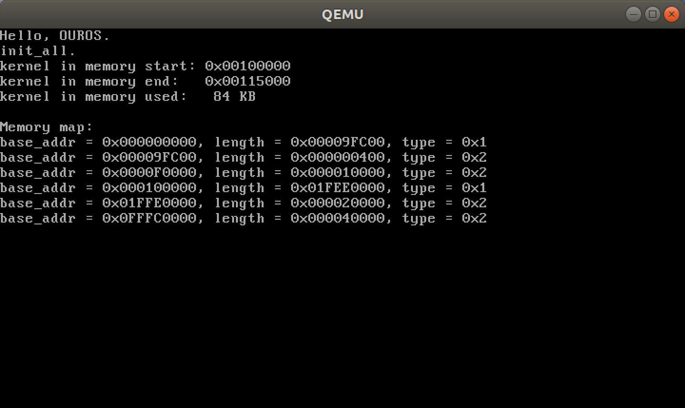
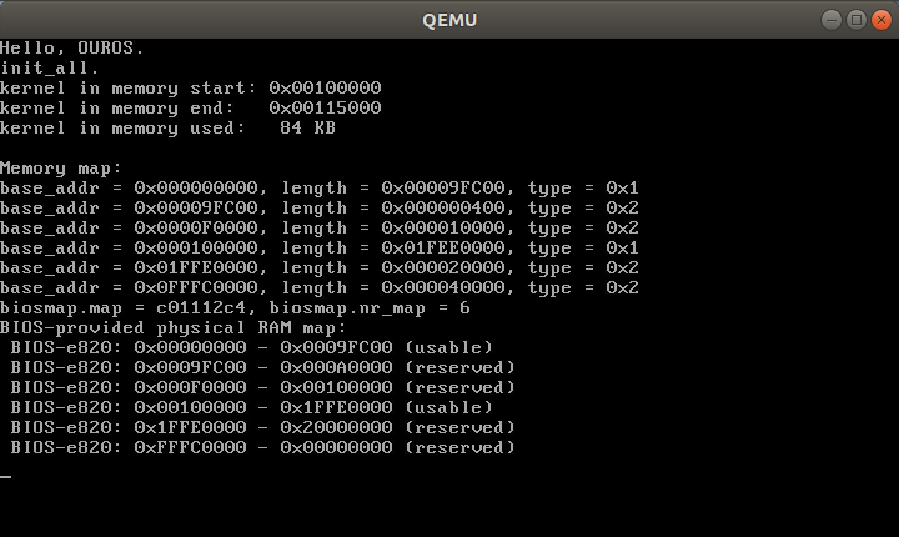
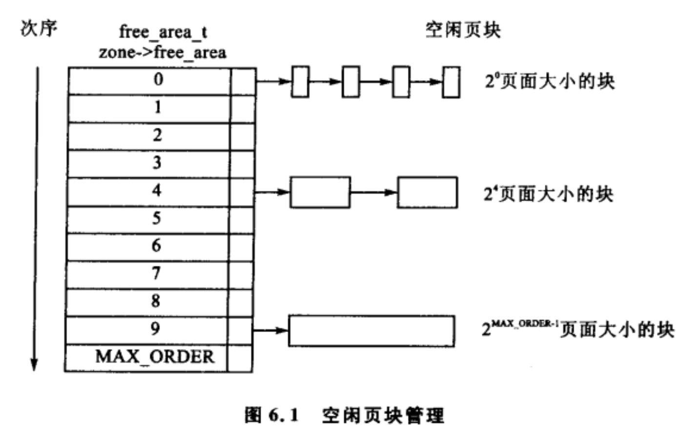
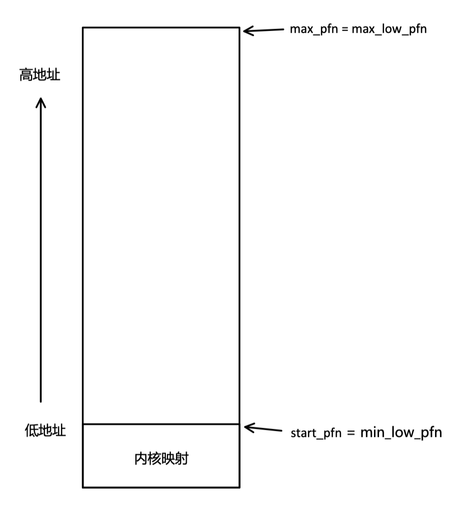
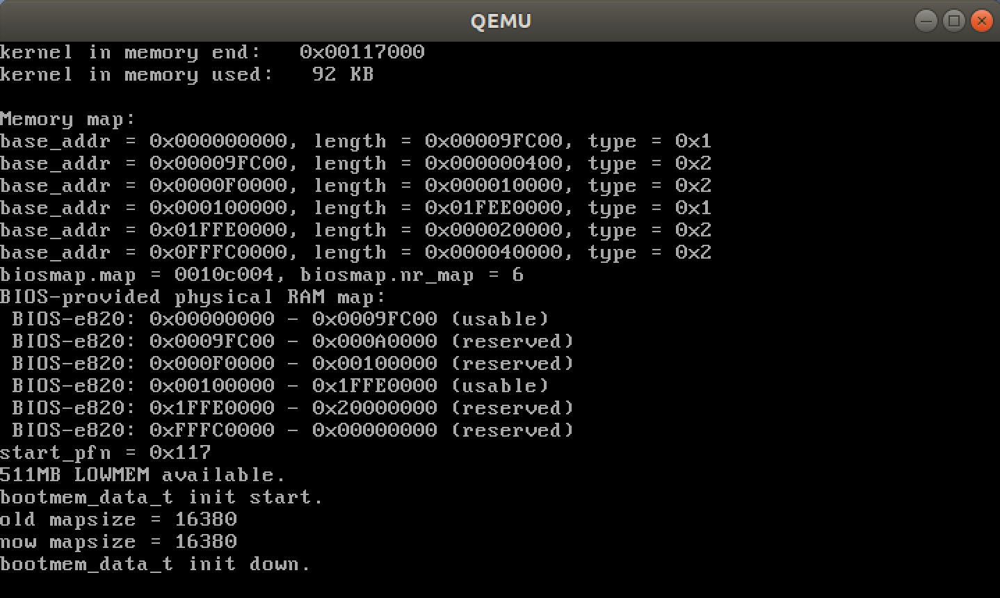
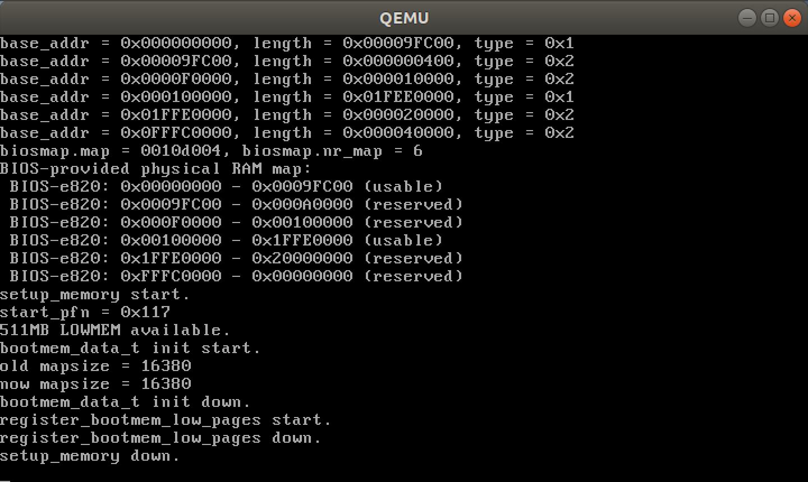
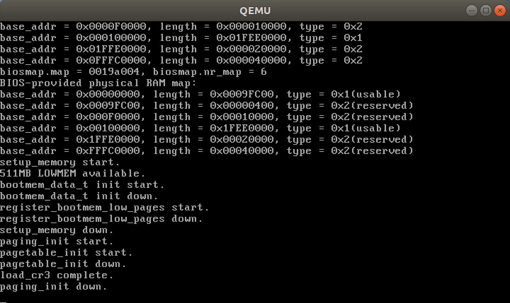
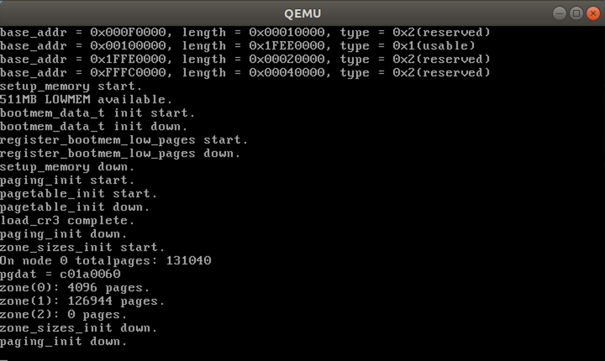

# OUROS-物理内存管理

关于内存，计算机最终使用的还是物理内存，所以在刚开始要对物理内存进行管理。任何一模块都会使用到内存管理，在最后的调用中就会使用到物理内存管理。

## 1 描述物理内存

> 参考书目：《深入理解 Linux 虚拟内存管理》
>
> 参考 Linux 内核版本：2.4.22

首先介绍内存管理的结构，在后续初始化时就会有所体现。

### 1.1 内存管理相关概念

#### 1.1.1 节点

对大型机器而言，内存会被分为许多簇。

每个簇被认为是一个节点，在 Linux 中的 struct pg_data_t 体现了这一概念。

分配页面时，Linux采用**局部分配**的策略，从最靠近运行的 CPU 的节点分配内存。

所有节点由pgdat_list链表维护。由函数init_bootmem_core()初始化节点。

在最新的内核中，有一个宏for_each_pgdat()，提高代码的可读性。

#### 1.1.2 管理区

内存中，每个节点被分成很多的称为管理区（zone）的块，用于表示内存中的某个范围。

管理区：一个管理区由一个 struct zone_struct 描述，被定义为 zone_t。用于跟踪诸如页面使用情况统计数，空闲区域和锁信息等。

每个管理区的类型都是ZONE_DMA，ZONE_NORMAL，ZONE_HIGHMEM中的一种。

ZONE_DMA：指==**低端范围**==的物理内存，某些工业标准体系结构（ISA）设备需要用到它。

ZONE_NORMAL：这部分的内存==**由内核直接映射到线性地址空间的较高部分**==。4.1节进一步讨论。影响性能最为重要的管理区。

ZONE_HIGHMEM：系统中预留的可用内存空间，不被内核直接映射。

>x86机器，管理区的示例如下：
>
>ZONE_DMA：内存的首部16MB
>
>ZONE_NORMAL：16MB～896MB
>
>ZONE_HIGHMEM：896MB～末尾

#### 1.1.3 页面

系统的内存划分成大小确定的许多块，这些块也称为**页面帧**。每个页面帧有一个 `struct page` 描述，所有的结构都存储在一个 `mem_map` 数组中。系统中的每一个物理页都有一个相关联的 `struct page` 用以记录该页面的状态。

### 2 物理内存管理

物理内存初始化在 `start_kernel()` 函数中的 `setup_arch()` 完成。

对物理内存的管理首先确定管理的范围。这里作出简单化处理，使用单核 CPU，内存模型为 UMA（均匀内存访问），故只有一个节点。

#### 2.1 描述物理内存

系统中的可用内存通过 GRUB 的 Mutliboot 协议获得。从协议中得知，我们会获得一个 multiboot_t 结构体，其中包含了内存地址信息。如下所示：

```c
typedef
struct multiboot_t {
    ......
    /**
     * 以下两项指出保存由BIOS提供的内存分布的缓冲区的地址和长度
     * mmap_addr是缓冲区的地址，mmap_length是缓冲区的总大小
     * 缓冲区由一个或者多个下面的大小/结构对 mmap_entry_t 组成
     */
    uint32_t mmap_length;
    uint32_t mmap_addr;
    ......
} __attribute__((packed)) multiboot_t;

/**
 * size是相关结构的大小，单位是字节，它可能大于最小值20
 * base_addr_low是启动地址的低32位，base_addr_high是高32位，启动地址总共有64位
 * length_low是内存区域大小的低32位，length_high是内存区域大小的高32位，总共是64位
 * type是相应地址区间的类型，1代表可用RAM，所有其它的值代表保留区域
 */
typedef
struct mmap_entry_t {
    uint32_t size; 		// 留意 size 是不含 size 自身变量的大小
    uint32_t base_addr_low;
    uint32_t base_addr_high;
    uint32_t length_low;
    uint32_t length_high;
    uint32_t type;
} __attribute__((packed)) mmap_entry_t;
```

GRUB 将内存探测的结果按每个分段整理为 `mmap_entry` 结构体的数组。`mmap_addr` 是这个结构体数组的首地址，`mmap_length` 是整个数组的长度。

这里需要留意的是 `mmap_entry` 结构体的size成员指的是除了 `size` 之外的成员的大小。至于 `base` 和 `length` 拆为了两段是因为物理地址可能用 32位 表示不下，不过我们只考虑32位操作系统。`type` 成员用来描述这个内存段的属性，因为物理不一定指向 RAM 里，也可能是其它外设。

下面的代码实现了遍历这个结构，打印所有物理内存段的操作。打印代码如下。

```c
// arch/i386/kernel/setup.c - show_memory_map()
void show_memory_map()
{
    uint32_t mmap_addr = ((multiboot_t*)glb_mboot_ptr)->mmap_addr;
    uint32_t mmap_length = ((multiboot_t*)glb_mboot_ptr)->mmap_length;

    printk("Memory map:\n");

    mmap_entry_t *mmap = (mmap_entry_t *)mmap_addr;
    for (mmap = (mmap_entry_t *)mmap_addr; (uint32_t)mmap < mmap_addr + mmap_length; mmap++) {
        printk("base_addr = 0x%X%08X, length = 0x%X%08X, type = 0x%X\n",
            (uint32_t)mmap->base_addr_high, (uint32_t)mmap->base_addr_low,
            (uint32_t)mmap->length_high, (uint32_t)mmap->length_low,
            (uint32_t)mmap->type);
    }
}
```

> 该代码只是想简单看一下内存布局的大致情况，Linux 中是没有的，可不写，也就没有画在上面的树状图中。

在 `setup_arch()` 中调用该函数。代码如下。

```c
// arch/i386/kernel/setup.c - setup_arch()
extern char _text, _etext, _edata, _end, _start;
void setup_arch(void)
{
	unsigned long max_low_pfn;
	
	printk("kernel in memory start: 0x%08X\n", &_start);
    printk("kernel in memory end:   0x%08X\n", &_end - 0xc0000000);
    printk("kernel in memory used:   %d KB\n\n", (&_end - 0xc0000000 - &_start + 1023) / 1024);

	show_memory_map();
}
```

编译运行后得到如下结果。



> 图中也显示了内核的起始地址和结束地址，以及内核大小。显示代码如下所示：

#### 2.2 setup_memory_region()

首先调用 `setup_memory_region()` 函数，这个函数处理内存构成图（map），并把内存的分布信息存放在全局变量 `e820` 中，后面会对此函数进行具体描述。该函数代码如下所示。

```c
static void __init setup_memory_region(void)
{
	char *who = "BIOS-e820";
	
	init_biosmap();
	printk("biosmap.map = %p, biosmap.nr_map = %d\n", biosmap.map, biosmap.nr_map);
	sanitize_e820_map(biosmap.map, &biosmap.nr_map);
	copy_e820_map(biosmap.map, biosmap.nr_map);
	printk("BIOS-provided physical RAM map:\n");
	print_memory_map(who);
}
```

将 mmap 中的内容复制到 `biosmap` 结构中。代码如下。

```c
void __init init_biosmap()
{
	int count = 0;
    multiboot_t *mboot_ptr = glb_mboot_ptr;
    mmap_entry_t *mmap_start_addr = (mmap_entry_t *)mboot_ptr->mmap_addr;
    mmap_entry_t *mmap_end_addr = (mmap_entry_t *)(mboot_ptr->mmap_addr + mboot_ptr->mmap_length);
    mmap_entry_t *map_entry;

    max_pfn = 0;
    for (map_entry = mmap_start_addr; map_entry < mmap_end_addr; map_entry++) {
        unsigned long start, end, type;
        biosmap.map[count].addr = map_entry->base_addr_low;
        biosmap.map[count].size = map_entry->length_low;
        biosmap.map[count].type = map_entry->type;
        count++;
    }
    biosmap.nr_map = count;
}
```

删除内存构成图中任何重叠的部分，因为 BIOS 所报告的内存构成图可能有重叠。代码如下。

```c
/**
 * sanitize_e820_map - 对整个表排序
 * Some e820 responses include overlapping entries.  The following
 * replaces the original e820 map with a new one, removing overlaps.
 * **/
static int __init sanitize_e820_map(struct e820entry *biosmap, int *pnr_map)
{
	struct change_member {
		struct e820entry *pbios;   // 指向原始 bios条目 的指针，pointer to original bios entry
		unsigned long long addr;   // 此更改点的地址，address for this change point
	};
	struct change_member change_point_list[2 * E820MAX];   // E820MAX = 32
	struct change_member *change_point[2 * E820MAX];
	struct e820entry *overlap_list[E820MAX];
	struct e820entry new_bios[E820MAX];
	struct change_member *change_tmp;

	unsigned long current_type, last_type;
	unsigned long long last_addr;
	int chgidx, still_changing;
	int overlap_entries;
	int new_bios_entry;
	int old_nr, new_nr, chg_nr;
	int i;

	/* if there's only one memory region, don't bother */
	if(*pnr_map < 2)
		return -1;

	old_nr = *pnr_map;

	/* bail out if we find any unreasonable addresses in bios map */
	/* 如果我们在 bios map 中发现任何不合理的地址，退出 */
	for(i = 0; i < old_nr; i++) {
		if(biosmap[i].addr + biosmap[i].size < biosmap[i].addr) {
			return -1;
		}
	}

	/* create pointers for initial change-point information (for sorting) */
	/* 为初始变化点信息创建指针（用于排序） */
	for(i = 0; i < 2 * old_nr; i++) {
		change_point[i] = &change_point_list[i];
	}

	/* record all known change-points (starting and ending addresses) ,
	   omitting those that are for empty memory regions 
	   记录所有已知的变更点（开始和结束地址）,
	   省略那些用于空内存区域的 */
	chgidx = 0;
	for(i = 0; i < old_nr; i++) {   // change_point 每两项对应 biosmap 的一项。两项中的前一项记录起始地址，后一项记录结束地址
		if(biosmap[i].size != 0) {
			change_point[chgidx]->addr = biosmap[i].addr;   // 记录起始地址
			change_point[chgidx++]->pbios = &biosmap[i];
			change_point[chgidx]->addr = biosmap[i].addr + biosmap[i].size;   // 记录结束地址
			change_point[chgidx++]->pbios = &biosmap[i];
		}
	}
	chg_nr = chgidx;   // true number of change-points

	/* sort change-point list by memory addresses (low -> high) */
	/* 按内存地址排序 change-point list（低 -> 高）*/
	still_changing = 1;
	while (still_changing)	{
		still_changing = 0;
		for (i=1; i < chg_nr; i++)  {
			/* if <current_addr> > <last_addr>, swap */
			/* or, if current=<start_addr> & last=<end_addr>, swap */
			if ((change_point[i]->addr < change_point[i-1]->addr) ||
				((change_point[i]->addr == change_point[i-1]->addr) &&
				 (change_point[i]->addr == change_point[i]->pbios->addr) &&
				 (change_point[i-1]->addr != change_point[i-1]->pbios->addr))
			   )
			{
				change_tmp = change_point[i];
				change_point[i] = change_point[i-1];
				change_point[i-1] = change_tmp;
				still_changing=1;
			}
		}
	}

	/* create a new bios memory map, removing overlaps */
	/* 创建一个新的 bios 内存映射，去除重叠 */
	overlap_entries = 0;   // 重叠表中的条目数(number of entries in the overlap table)
	new_bios_entry = 0;    // 创建新的 BIOS 映射条目的索引(index for creating new bios map entries)
	last_type = 0;         // start with undefined memory type = 从未定义的内存类型起始处
	last_addr = 0;         // start with 0 as last starting address = 以 0 开头作为最后一个起始地址
	/* loop through change-points, determining affect on the new bios map */
	/* 遍历更改点，确定对新的 bios map 的影响 */
	for(chgidx = 0; chgidx < chg_nr; chgidx++) {
		/* keep track of all overlapping bios entries */
		/* 跟踪所有重叠的 bios 条目 */
		if(change_point[chgidx]->addr == change_point[chgidx]->pbios->addr) {
			/* add map entry to overlap list (> 1 entry implies an overlap) */
			/* 将映射条目添加到重叠列表（> 1 个条目意味着重叠）*/
			overlap_list[overlap_entries++] = change_point[chgidx]->pbios;
		} else {
			/* remove entry from list (order independent, so swap with last) */
			/* 从列表中删除条目（顺序无关，因此与最后一个交换）*/
			for(i = 0; i < overlap_entries; i++) {
				if(overlap_list[i] == change_point[chgidx]->pbios) {
					overlap_list[i] = overlap_list[overlap_entries - 1];
				}
				overlap_entries--;
			}
		}
		/* if there are overlapping entries, decide which "type" to use */
		/* (larger value takes precedence -- 1=usable, 2,3,4,4+=unusable) */
		/* 如果有重叠的条目，决定使用哪个“类型” */
		/*（较大的值优先——1=可用，2,3,4,4+=不可用）*/
		current_type = 0;
		for(i = 0; i < overlap_entries; i++) {
			if(overlap_list[i]->type > current_type) {
				current_type = overlap_list[i]->type;
			}
		}
		/* continue building up new bios map based on this information */
		/* 根据这些信息构建新的 bios map */
		if(current_type != last_type) {
			if(last_type != 0) {
				new_bios[new_bios_entry].size = change_point[chgidx]->addr - last_addr;
				/* move forward only if the new size was non-zero */
				/* 仅当新大小不为零时才向前移动 */
				if(new_bios[new_bios_entry].size != 0) {
					if(++new_bios_entry >= E820MAX) { break; }   /* 没有更多空间用于新的 bios 条目, no more space left for new bios entries */
				}
			}
			if (current_type != 0)	{
				new_bios[new_bios_entry].addr = change_point[chgidx]->addr;
				new_bios[new_bios_entry].type = current_type;
				last_addr=change_point[chgidx]->addr;
			}
			last_type = current_type;
		}
	}
	new_nr = new_bios_entry;   /* 为新的 bios 条目保留计数, retain count for new bios entries */
	/* copy new bios mapping into original location */
	/* 将新的 bios 映射复制到原始位置 */
	memcpy(biosmap, new_bios, new_nr * sizeof(struct e820entry));
	*pnr_map = new_nr;

	return 0;
}
```

然后将 `biosmap` 中的内容复制到 `e820` 中。在下述代码中会进行更细致的检查。

```c
/*
 * Copy the BIOS e820 map into a safe place.
 *
 * Sanity-check it while we're at it..
 *
 * If we're lucky and live on a modern system, the setup code
 * will have given us a memory map that we can use to properly
 * set up memory.  If we aren't, we'll fake a memory map.
 *
 * We check to see that the memory map contains at least 2 elements
 * before we'll use it, because the detection code in setup.S may
 * not be perfect and most every PC known to man has two memory
 * regions: one from 0 to 640k, and one from 1mb up.  (The IBM
 * thinkpad 560x, for example, does not cooperate with the memory
 * detection code.)
 */
static int __init copy_e820_map(struct e820entry * biosmap, int nr_map)
{
	/* Only one memory region (or negative)? Ignore it */
	if(nr_map < 2) {
		return -1;
	}
	do{
		unsigned long long start = biosmap->addr;
		unsigned long long size = biosmap->size;
		unsigned long long end = start + size;
		unsigned long type = biosmap->type;

		/* Overflow in 64 bits? Ignore the memory map. */
		if (start > end)
			return -1;

		/*
		 * Some BIOSes claim RAM in the 640k - 1M region.
		 * Not right. Fix it up.
		 */
		if (type == E820_RAM) {
			if (start < 0x100000ULL && end > 0xA0000ULL) {
				if (start < 0xA0000ULL)
					add_memory_region(start, 0xA0000ULL-start, type);
				if (end <= 0x100000ULL)
					continue;
				start = 0x100000ULL;
				size = end - start;
			}
		}
		add_memory_region(start, size, type);
	} while(biosmap++, --nr_map);
}
```

最后将内存信息打印，`e820` 的内容打印出来。代码如下。

```c
static void __init print_memory_map(char *who)
{
	int i;

	for (i = 0; i < e820.nr_map; i++) {
		printk(" %s: 0x%08X - 0x%08X ", who,
            (uint32_t)e820.map[i].addr,
            (uint32_t)e820.map[i].addr + (uint32_t)e820.map[i].size);
		// printk(" %s: %016Lx - %016Lx ", who,
			// e820.map[i].addr,
			// e820.map[i].addr + e820.map[i].size);
		switch (e820.map[i].type) {
		case E820_RAM:	printk("(usable)\n");
				break;
		case E820_RESERVED:
				printk("(reserved)\n");
				break;
		case E820_ACPI:
				printk("(ACPI data)\n");
				break;
		case E820_NVS:
				printk("(ACPI NVS)\n");
				break;
		default:
				printk("type %lu\n", e820.map[i].type);
				break;
		}
	}
}
```

编译运行，结果如下图所示。



#### 2.3 setup_memory()

该函数所做的工作：

* 找到低端内存的 PFN 的起点和终点（min_low_pfn，max_low_pfn），找到高端内存的 PFN 的起点和终点（highstart_pfn，highd_pfn），以及找到系统中最后一页的 PFN。
* 初始化 bootmem_data 结构以及声明可能被引导内存分配器用到的页面。
* 标记所有系统可用的页面为空闲，然后为那些表示页面的位图保留页面。
* 在 SMP 配置或 initrd 镜像存在时，为他们保留页面。（OUROS 暂不支持 SMP）

宏定义：

```c
#define PFN_UP(x)    (((x) + PAGE_SIZE-1) >> PAGE_SHIFT)
#define PFN_DOWN(x)     ((x) >> PAGE_SHIFT)
#define PFN_PHYS(x)     ((x) << PAGE_SHIFT)
```

PFN_UP()  和PFN_DOWN() 都是将地址 x 转换为页面号（PFN即Page Frame Number的缩写），二者之间的区别为：PFN_UP()返回大于 x 的第一个页面号，而PFN_DOWN（）返回小于x的第一个页面号。宏PFN_PHYS() 返回页面号x的物理地址。

获取可以使用起始 PFN。

```c
// arch/asm-i386/kernel/setup.c - setup_memory()
start_pfn = PFN_UP(__pa(&_end));
```

获得可以使用的最大 PFN。

```c
// arch/asm-i386/kernel/setup.c - find_max_pfn()
/*
 * Find the highest page frame number we have available
 */
static void find_max_pfn(void)
{
    int i;

	max_pfn = 0;
	for (i = 0; i < e820.nr_map; i++) {
		unsigned long start, end;
		/* RAM? */
		if (e820.map[i].type != E820_RAM)
			continue;
		start = PFN_UP(e820.map[i].addr);
		end = PFN_DOWN(e820.map[i].addr + e820.map[i].size);
		if (start >= end)
			continue;
		if (end > max_pfn)
			max_pfn = end;
	}
}
```

确定最高内存范围。

```c
// arch/asm-i386/kernel/setup.c - find_max_low_pfn()
/*
 * Determine low and high memory ranges:
 */
static unsigned long find_max_low_pfn(void)
{
    unsigned long max_low_pfn;

    max_low_pfn = max_pfn;
    if (max_low_pfn > MAXMEM_PFN) {
        max_low_pfn = MAXMEM_PFN;
    }
    return max_low_pfn;
}
```

为物理内存页面管理机制的建立做初步准备，为整个物理内存建立起一个页面位图。这个位图建立在从start_pfn开始的地方，也就是说，把内核映像终点_end上方的若干页面用作物理页面位图。在前面的代码中已经搞清楚了物理内存顶点所在的页面号为max_low_pfn，所以物理内存的页面号一定在0～max_low_pfn之间。可是，在这个范围内可能有空洞（hole），另一方面，并不是所有的物理内存页面都可以动态分配。建立这个位图的目的就是要搞清楚哪一些物理内存页面可以动态分配的。

`bootmem_data_t` 结构如下所示：

```c
// include/linux/bootmem.h
/*
 * node_bootmem_map is a map pointer - the bits represent all physical
 * memory pages (including holes) on the node.
 * node_bootmem_map 是一个指向映射映射的指针 - 映射的位代表节点上的所有物理内存页（包括空洞）
 */
typedef struct bootmem_data {
	unsigned long node_boot_start;
	unsigned long node_low_pfn;
	void *node_bootmem_map;
	unsigned long last_offset;
	unsigned long last_pos;
} bootmem_data_t;
```

初始化 `bootmem_data_t` 的代码如下所示。

```c
// mm/bootmem.c - init_bootmem()
unsigned long __init init_bootmem (unsigned long start, unsigned long pages)
{
	max_low_pfn = pages;
	min_low_pfn = start;
	return(init_bootmem_core(&contig_page_data, start, 0, pages));
}
```

其中主要的是 `init_bootmem_core()` 函数。该函数的申明如下。

```c
static unsigned long __init init_bootmem_core (pg_data_t *pgdat,
	unsigned long mapstart, unsigned long start, unsigned long end)
```

其中 pg_data_t 结构描述的是一个节点。该结构体代码如下所示。

```c
// include/linux/mmzone.h
typedef struct pglist_data {
	zone_t node_zones[MAX_NR_ZONES];
	zonelist_t node_zonelists[GFP_ZONEMASK+1];
	int nr_zones;
	struct page *node_mem_map;
	unsigned long *valid_addr_bitmap;
	struct bootmem_data *bdata;
	unsigned long node_start_paddr;
	unsigned long node_start_mapnr;
	unsigned long node_size;
	int node_id;
	struct pglist_data *node_next;
} pg_data_t;

extern int numnodes;
extern pg_data_t *pgdat_list;
extern pg_data_t contig_page_data;
```

`numnodes` 和 `contig_page_data` 定义在 `numa.c` 文件中。代码如下。

```c
// mm/numa.c
#include <linux/mmzone.h>
#include <linux/bootmem.h>

int numnodes = 1;   /* Initialized for UMA platforms */

static bootmem_data_t contig_bootmem_data;
pg_data_t contig_page_data = { bdata: &contig_bootmem_data };
```

pgdat_list 定义在 page_alloc.c 中。代码如下。

```c
// mm/page_alloc.c
#include <linux/mmzone.h>

pg_data_t *pgdat_list;
```

`pg_data_t` 中 `zone_t` 描述的是一个管理区。`zone_t` 结构体的代码如下所示。

```c
// include/linux/mmzone.h
/*
 * On machines where it is needed (eg PCs) we divide physical memory
 * into multiple physical zones. On a PC we have 3 zones:
 *
 * ZONE_DMA	  < 16 MB	ISA DMA capable memory
 * ZONE_NORMAL	16-896 MB	direct mapped by the kernel
 * ZONE_HIGHMEM	 > 896 MB	only page cache and user processes
 */
typedef struct zone_struct {
	/*
	 * Commonly accessed fields:
	 */
	// spinlock_t		lock;
	unsigned long		free_pages;
	unsigned long		pages_min, pages_low, pages_high;
	int			need_balance;

	/*
	 * free areas of different sizes
	 */
	free_area_t		free_area[MAX_ORDER];
	
    /*
	 * wait_table		-- the array holding the hash table
	 * wait_table_size	-- the size of the hash table array
	 * wait_table_shift	-- wait_table_size
	 * 				== BITS_PER_LONG (1 << wait_table_bits)
	 */
	wait_queue_head_t	* wait_table;
	unsigned long		wait_table_size;
	unsigned long		wait_table_shift;

	/*
	 * Discontig memory support fields.
	 */
	struct pglist_data	*zone_pgdat;
	struct page		*zone_mem_map;
	unsigned long		zone_start_paddr;
	unsigned long		zone_start_mapnr;

	/*
	 * rarely used fields:
	 */
	char			*name;
	unsigned long		size;
} zone_t;

#define ZONE_DMA		0
#define ZONE_NORMAL		1
#define ZONE_HIGHMEM	2
#define MAX_NR_ZONES	3

typedef struct zonelist_struct {
	zone_t * zones [MAX_NR_ZONES + 1];   // NULL delimited
} zonelist_t;

#define GFP_ZONEMASK	0x0f
```

这里需要一个自旋锁。

依赖文件：

```text
include/asm/system.h
include/asm/atomic.h
include/asm/bitops.h
```

然后移植：

```text
include/linux/spinlock.h
```

`free_area_t` 结构体是内核对每一个不同大小空闲块的描述，用于指向一个空闲页面块的链表。示意图如下所示。



> 图片取自：《深入理解Linux虚拟内存管理》

`free_area_t` 结构体的定义如下所示：

```c
// include/linux/mmzone.h
typedef struct free_area_struct {
	struct list_head	free_list;   //空闲页面块的链表
	unsigned long		*map;   //表示一对伙伴状态的位图
} free_area_t;
```

这里需要链表操作。下面定义链表和链表操作。

```c
// include/linux/list.h
#ifndef _LINUX_LIST_H
#define _LINUX_LIST_H

#include <asm/types.h>

/*
 * Simple doubly linked list implementation.
 *
 * Some of the internal functions ("__xxx") are useful when
 * manipulating whole lists rather than single entries, as
 * sometimes we already know the next/prev entries and we can
 * generate better code by using them directly rather than
 * using the generic single-entry routines.
 */

struct list_head {
	struct list_head *next, *prev;
};

#define LIST_HEAD_INIT(name) { prev: &(name), next: &(name) }

#define LIST_HEAD(name) \
	struct list_head name = LIST_HEAD_INIT(name)

#define INIT_LIST_HEAD(ptr) do { \
	(ptr)->next = (ptr); (ptr)->prev = (ptr); \
} while (0)

/*
 * Insert a new entry between two known consecutive entries.
 *
 * This is only for internal list manipulation where we know
 * the prev/next entries already!
 */
static inline void __list_add(struct list_head *new,
			      struct list_head *prev,
			      struct list_head *next)
{
	next->prev = new;
	new->next = next;
	new->prev = prev;
	prev->next = new;
}

/**
 * list_add - add a new entry
 * @new: new entry to be added
 * @head: list head to add it after
 *
 * Insert a new entry after the specified head.
 * This is good for implementing stacks.
 */
static inline void list_add(struct list_head *new, struct list_head *head)
{
	__list_add(new, head, head->next);
}

/**
 * list_add_tail - add a new entry
 * @new: new entry to be added
 * @head: list head to add it before
 *
 * Insert a new entry before the specified head.
 * This is useful for implementing queues.
 */
static inline void list_add_tail(struct list_head *new, struct list_head *head)
{
	__list_add(new, head->prev, head);
}

/*
 * Delete a list entry by making the prev/next entries
 * point to each other.
 *
 * This is only for internal list manipulation where we know
 * the prev/next entries already!
 */
static inline void __list_del(struct list_head *prev, struct list_head *next)
{
	next->prev = prev;
	prev->next = next;
}

/**
 * list_del - deletes entry from list.
 * @entry: the element to delete from the list.
 * Note: list_empty on entry does not return true after this, the entry is in an undefined state.
 */
static inline void list_del(struct list_head *entry)
{
	__list_del(entry->prev, entry->next);
	entry->next = (void *) 0;
	entry->prev = (void *) 0;
}

/**
 * list_del_init - deletes entry from list and reinitialize it.
 * @entry: the element to delete from the list.
 */
static inline void list_del_init(struct list_head *entry)
{
	__list_del(entry->prev, entry->next);
	INIT_LIST_HEAD(entry);
}

/**
 * list_move - delete from one list and add as another's head
 * @list: the entry to move
 * @head: the head that will precede our entry
 */
static inline void list_move(struct list_head *list, struct list_head *head)
{
        __list_del(list->prev, list->next);
        list_add(list, head);
}

/**
 * list_move_tail - delete from one list and add as another's tail
 * @list: the entry to move
 * @head: the head that will follow our entry
 */
static inline void list_move_tail(struct list_head *list,
				  struct list_head *head)
{
        __list_del(list->prev, list->next);
        list_add_tail(list, head);
}

static inline struct list_head *list_pop(struct list_head *head) {
    struct list_head *item = head->prev;
    list_del(head->prev);
    item->prev = item->next =NULL;
    return item;
}
/**
 * list_empty - tests whether a list is empty
 * @head: the list to test.
 */
static inline int list_empty(struct list_head *head)
{
	return head->next == head;
}

static inline void __list_splice(struct list_head *list,
				 struct list_head *head)
{
	struct list_head *first = list->next;
	struct list_head *last = list->prev;
	struct list_head *at = head->next;

	first->prev = head;
	head->next = first;

	last->next = at;
	at->prev = last;
}

/**
 * list_splice - join two lists
 * @list: the new list to add.
 * @head: the place to add it in the first list.
 */
static inline void list_splice(struct list_head *list, struct list_head *head)
{
	if (!list_empty(list))
		__list_splice(list, head);
}

/**
 * list_splice_init - join two lists and reinitialise the emptied list.
 * @list: the new list to add.
 * @head: the place to add it in the first list.
 *
 * The list at @list is reinitialised
 */
static inline void list_splice_init(struct list_head *list,
				    struct list_head *head)
{
	if (!list_empty(list)) {
		__list_splice(list, head);
		INIT_LIST_HEAD(list);
	}
}

/**
 * list_entry - get the struct for this entry
 * @ptr:	the &struct list_head pointer.
 * @type:	the type of the struct this is embedded in.
 * @member:	the name of the list_struct within the struct.
 */
#define list_entry(ptr, type, member) \
	((type *)((char *)(ptr)-(unsigned long)(&((type *)0)->member)))

/**
 * list_for_each	-	iterate over a list
 * @pos:	the &struct list_head to use as a loop counter.
 * @head:	the head for your list.
 */
#define list_for_each(pos, head) \
	for (pos = (head)->next; pos != (head); \
        	pos = pos->next)
/**
 * list_for_each_prev	-	iterate over a list backwards
 * @pos:	the &struct list_head to use as a loop counter.
 * @head:	the head for your list.
 */
#define list_for_each_prev(pos, head) \
	for (pos = (head)->prev; pos != (head); \
        	pos = pos->prev)

/**
 * list_for_each_safe	-	iterate over a list safe against removal of list entry
 * @pos:	the &struct list_head to use as a loop counter.
 * @n:		another &struct list_head to use as temporary storage
 * @head:	the head for your list.
 */
#define list_for_each_safe(pos, n, head) \
	for (pos = (head)->next, n = pos->next; pos != (head); \
		pos = n, n = pos->next)

/**
 * list_for_each_entry	-	iterate over list of given type
 * @pos:	the type * to use as a loop counter.
 * @head:	the head for your list.
 * @member:	the name of the list_struct within the struct.
 */
#define list_for_each_entry(pos, head, member)				\
	for (pos = list_entry((head)->next, typeof(*pos), member),	\
	     &pos->member != (head); 					\
	     pos = list_entry(pos->member.next, typeof(*pos), member))

static inline bool elem_find(struct list_head *head, struct list_head *elem) {
    struct list_head *pos;
    list_for_each(pos, head) {
        if(pos == elem) {
            return true;
        }
    }
    return false;
}

#endif /* __KERNEL__ || _LVM_H_INCLUDE */
```

> wait_table：等待该管理区中页面的进程会使用这个哈希表选择一个等待队列。所以页面解锁时，不需要唤醒管理区中所有的进程，只需要唤醒其中在该页面等待的进程。该成员和进程管理相关，暂时注释掉。

然后定义一些操作宏和函数。代码如下所示：

```c
// include/linux/mmzone.h
/**
 * for_each_pgdat - helper macro to iterate over all nodes
 * @pgdat - pg_data_t * variable
 *
 * Meant to help with common loops of the form
 * pgdat = pgdat_list;
 * while(pgdat) {
 * 	...
 * 	pgdat = pgdat->node_next;
 * }
 */
#define for_each_pgdat(pgdat) \
	for (pgdat = pgdat_list; pgdat; pgdat = pgdat->node_next)

/*
 * next_zone - helper magic for for_each_zone()
 * Thanks to William Lee Irwin III for this piece of ingenuity.
 */
static inline zone_t *next_zone(zone_t *zone)
{
	pg_data_t *pgdat = zone->zone_pgdat;

	if (zone - pgdat->node_zones < MAX_NR_ZONES - 1) {
		zone++;
	} else if (pgdat->node_next) {
		pgdat = pgdat->node_next;
		zone = pgdat->node_zones;
	} else {
		zone = (zone_t*)NULL;
	}

	return zone;
}

/**
 * for_each_zone - helper macro to iterate over all memory zones
 * @zone - zone_t * variable
 *
 * The user only needs to declare the zone variable, for_each_zone
 * fills it in. This basically means for_each_zone() is an
 * easier to read version of this piece of code:
 *
 * for(pgdat = pgdat_list; pgdat; pgdat = pgdat->node_next)
 * 	for(i = 0; i < MAX_NR_ZONES; ++i) {
 * 		zone_t * z = pgdat->node_zones + i;
 * 		...
 * 	}
 * }
 */
#define for_each_zone(zone) \
	for(zone = pgdat_list->node_zones; zone; zone = next_zone(zone))

#ifndef CONFIG_DISCONTIGMEM

#define NODE_DATA(nid)		(&contig_page_data)
#define NODE_MEM_MAP(nid)	mem_map
#define MAX_NR_NODES		1

#else /* !CONFIG_DISCONTIGMEM */

#include <asm/mmzone.h>

/* page->zone is currently 8 bits ... */
#ifndef MAX_NR_NODES
#define MAX_NR_NODES		(255 / MAX_NR_ZONES)
#endif

#endif /* !CONFIG_DISCONTIGMEM */

#define MAP_ALIGN(x)	((((x) % sizeof(mem_map_t)) == 0) ? (x) : ((x) + \
		sizeof(mem_map_t) - ((x) % sizeof(mem_map_t))))
```

然后使用函数 `init_bootmem()` 初始化 `bootmem_data_t` 结构。该函数代码如下所示。

```c
// mm/bootmem.c - init_bootmem()
unsigned long __init init_bootmem (unsigned long start, unsigned long pages)
{
	max_low_pfn = pages;
	min_low_pfn = start;
	return(init_bootmem_core(&contig_page_data, start, 0, pages));
}
```

该函数为 `max_low_pfn` 和 `min_low_pfn` 赋值后，然后调用 `init_bootmem_core()` 函数。可以看到主要的工作是由 `init_bootmem_core()` 完成的。到这里内存的简易示意图如下图所示。



`init_bootmem_core()` 具体内容如下所示：

```c
// mm/bootmem.c - init_bootmem_core()
/*
 * init_bootmem_core - Called once to set up the allocator itself.
 * 					   调用一次以设置分配器本身。
 * 返回值：位图大小（以字节为单位）
 */
static unsigned long __init init_bootmem_core (pg_data_t *pgdat,
	unsigned long mapstart, unsigned long start, unsigned long end)
{
	bootmem_data_t *bdata = pgdat->bdata;   // pg_data_t contig_page_data = { bdata: &contig_bootmem_data };
	unsigned long mapsize = ((end - start)+7)/8;   // 计算内存页位图的大小（以字节为单位），end = max_low_pfn，start = 0
	printk("old mapsize = %d\n", mapsize);

	pgdat->node_next = pgdat_list;   // 把 pgdat_data_t 插入到 pgdat_list 链表中
	pgdat_list = pgdat;

	mapsize = (mapsize + (sizeof(long) - 1UL)) & ~(sizeof(long) - 1UL);   // 保证是 4 的倍数
	printk("now mapsize = %d\n", mapsize);
	bdata->node_bootmem_map = phys_to_virt(mapstart << PAGE_SHIFT);   // 初始化位图的虚拟起始地址，该位图用于表示页面的使用情况
	bdata->node_boot_start = (start << PAGE_SHIFT);   // 记录该节点的起始物理地址 pfn
	bdata->node_low_pfn = end;   // 记录该节点的结束地址 pfn

	/*
	 * Initially all pages are reserved - setup_arch() has to
	 * register free RAM areas explicitly.
	 */
	memset(bdata->node_bootmem_map, 0xff, mapsize);   // 初始化位图

	return mapsize;
}
```

位图所需的大小以字节为单位计算，计算公式如下：
$$
\frac {(end - start) + 7}{8} \\\\ end = max\_low\_pfn \\\\ start = 0
$$
由于不存在与结构无关的方法来监测内存中的空洞，整个位图被初始化为 1。将可用内存页的位设置为 0 的工作交给与结构相关的代码完成。

> 《深入理解LInux虚拟内存管理》中有如下描述：
>
> “该位图的起始物理地址存放于 `bootmem_data_t->node_boot_start` 中，虚拟地址存放于 `bootmem_data_t->node_bootmem_map` 中。”
>
> 个人认为前半句有误，因为 `bootmem_data_t->node_boot_start` 记录的是节点的起始物理地址。

在头文件中加上函数的声明：

```c
// include/linux/bootmem.h
// extern unsigned long __init init_bootmem (unsigned long addr, unsigned long memend);
unsigned long __init init_bootmem (unsigned long start, unsigned long pages);
```

> linux 源码中在该函数声明前添加了 extern 关键字。

在 `init_bootmem_core()` 函数中添加提示信息：

```c
static unsigned long __init init_bootmem_core (pg_data_t *pgdat,
	unsigned long mapstart, unsigned long start, unsigned long end)   // init_bootmem_core(&contig_page_data, start, 0, pages)
{
	printk("bootmem_data_t init start.\n");
	...;
    ...;
    ...;
	printk("bootmem_data_t init down.\n");
	return mapsize;
}
```

此时，`setup_memeory()` 的代码如下所示。

```c
static unsigned long setup_memory(void)
{
	printk("setup_memory start.\n");
	unsigned long bootmap_size, start_pfn, max_low_pfn;
	
	/*
	 * partially used pages are not usable - thus
	 * we are rounding upwards:
	 */
	start_pfn = PFN_UP(__pa(&_end));   //将物理地址向上取整到下一个页面。__end是已载入内核的底端地址，所以start_pfn是第一块可以被用到的物理页面帧的偏移
	printk("start_pfn = 0x%x\n", start_pfn);
	
	find_max_pfn();   //遍历e820图，查找最高的可用PFN
	
	max_low_pfn = find_max_low_pfn();

	printk("%ldMB LOWMEM available.\n",
			pages_to_mb(max_low_pfn));
	/*
	 * Initialize the boot-time allocator (with low memory only):
	 */
	bootmap_size = init_bootmem(start_pfn, max_low_pfn);
}
```

其中 `pages_to_mb()` 的代码如下。

```c
// include/asm/pgtable.h
#ifndef _I386_PGTABLE_H
#define _I386_PGTABLE_H

#define pages_to_mb(x) ((x) >> (20-PAGE_SHIFT))

#endif /* _I386_PGTABLE_H */
```

在 `setup_arch()` 中调用 `setup_memory()` 函数。代码如下。

```c
void setup_arch(void)
{
	unsigned long max_low_pfn;
	
	printk("kernel in memory start: 0x%08X\n", &_start);
    printk("kernel in memory end:   0x%08X\n", &_end - 0xc0000000);
    printk("kernel in memory used:   %d KB\n\n", (&_end - 0xc0000000 - &_start + 1023) / 1024);

	show_memory_map();
	setup_memory_region();
	max_low_pfn = setup_memory();
}
```

编译运行结果如下图所示。



在 x86 架构中，`register_bootmem_low_pages()` 通过检测 `e820` 映射图，并在每个页面上调用 `free_bootmem()` 函数，将其位设置为 1，然后再调用 `reserve_bootmem()` 函数为保存实际位图所需的页面预留空间。

首先实现 `free_bootmem()` 函数。函数代码如下。

```c
// mm/bootmem.c - free_bootmem()
void __init free_bootmem(unsigned long addr, unsigned long size)
{
	return(free_bootmem_core(contig_page_data.bdata, addr, size));
}
```

可以看到主要工作由 `free_bootmem_core()` 函数完成。该函数代码如下所示。

```c
// mm/bootmem.c - free_bootmem_core()
static void __init free_bootmem_core(bootmem_data_t *bdata, unsigned long addr, unsigned long size)
{
	unsigned long i;
	unsigned long start;
	/*
	 * round down end of usable mem, partially free pages are
	 * considered reserved.
	 */
	unsigned long sidx;
	unsigned long eidx = (addr + size - bdata->node_boot_start) / PAGE_SIZE;
	unsigned long end = (addr + size) / PAGE_SIZE;

	if (!size) BUG();
	if (end > bdata->node_low_pfn) {
		BUG();
	}

	/*
	 * Round up the beginning of the address.
	 */
	start = (addr + PAGE_SIZE-1) / PAGE_SIZE;
	sidx = start - (bdata->node_boot_start/PAGE_SIZE);

	for (i = sidx; i < eidx; i++) {
		if (!test_and_clear_bit(i, bdata->node_bootmem_map))
			BUG();
	}
}
```

`test_and_clear_bit()` 函数代码如下所示。

```c
// include/asm/bitops.h
/**
 * test_and_clear_bit - Clear a bit and return its old value
 *                      在起始地址为addr的位图中清除第nr位，并返回原来的值，原子操作
 * @nr: Bit to clear
 * @addr: Address to count from
 *
 * This operation is atomic and cannot be reordered.
 * It also implies a memory barrier.
 */
static __inline__ int test_and_clear_bit(int nr, volatile void * addr)
{
    int oldbit;

    __asm__ __volatile__( LOCK_PREFIX
    "btrl %2,%1\n\tsbbl %0,%0"
    :"=r" (oldbit),"=m" (ADDR)
    :"Ir" (nr) : "memory");
    return oldbit;
}
```

`ADDR`（一个内存变量）中的`nr`变量对应的比特位清除（置0），原来的值存放于 oldbit 中，若btrl执行失败，FLAG 寄存器的CF 位置位，则 sbbl 指令执行后oldbit的值为 -1；若执行成功，oldbit 的值为 0。

> btrl指令：`ADDR`（一个内存变量）中的`nr`变量对应的比特位清除（置0）。
>
> btsl指令：`ADDR`（一个内存变量）中的`nr`变量对应的比特位将设为 1。
>
> `btrl` 指令的两个操作数不能全是内存变量，因此将 nr 的限定字符串指定为“Ir”，将 nr 与立即数或者寄存器相关联，这样两个操作数中只有 ADDR 为内存变量。
>
> 限制符 `Ir` 指出，`pos`是一个寄存器，且它的值介于0-31（x86限制符）。
>
> 限制符 Ir 参考：
>
> https://xuxeu.github.io/inline-gccasm-9/
>
> http://www.ibiblio.org/gferg/ldp/GCC-Inline-Assembly-HOWTO.html
>
> sbb指令：带借位减法。

修改 `include/linux/bootmem.h` 的内容，添加函数声明。如下所示。

```c
// include/linux/bootmem.h
// extern void __init free_bootmem (unsigned long addr, unsigned long size);   // linux 内核源码
void __init free_bootmem (unsigned long addr, unsigned long size);
```

在 `register_bootmem_low_pages()` 函数前后添加提示信息。代码如下。

```c
// arch/i386/kernel/setup.c
/*
 * Register fully available low RAM pages with the bootmem allocator.
 * 注册完全可用的低 RAM 页面。
 */
static void __init register_bootmem_low_pages(unsigned long max_low_pfn)
{
	printk("register_bootmem_low_pages start.\n");
	...;
    ...;
    ...;
	printk("register_bootmem_low_pages down.\n");
}
```

然后保留一些内存，这些内存已经被使用或者有特殊的用途，所以标记为已使用。函数 reserve_bootmem() 用于将内存保留。代码如下。

```c
// mm/bootmem.c - reserve_bootmem()
void __init reserve_bootmem (unsigned long addr, unsigned long size)
{
	return(contig_page_data.bdata, addr, size);
}
```

```c
// mm/bootmem.c - reserve_bootmem_core()
static void __init reserve_bootmem_core(bootmem_data_t *bdata, unsigned long addr, unsigned long size)
{
	unsigned long i;
	/*
	 * round up, partially reserved pages are considered
	 * fully reserved.
	 */
	unsigned long sidx = (addr - bdata->node_boot_start)/PAGE_SIZE;
	unsigned long eidx = (addr + size - bdata->node_boot_start + 
							PAGE_SIZE-1)/PAGE_SIZE;
	unsigned long end = (addr + size + PAGE_SIZE-1)/PAGE_SIZE;

	if (!size) BUG();

	if (sidx < 0) { BUG(); }
	if (eidx < 0) { BUG(); }
	if (sidx >= eidx) { BUG(); }
	if ((addr >> PAGE_SHIFT) >= bdata->node_low_pfn) { BUG(); }
	if (end > bdata->node_low_pfn) { BUG(); }
	for (i = sidx; i < eidx; i++) {
		if (test_and_set_bit(i, bdata->node_bootmem_map)) {
			printk("hm, page %08lx reserved twice.\n", i*PAGE_SIZE);
		}
	}
}
```

```c
// include/asm/bitops.h - test_and_set_bit()
/**
 * test_and_set_bit - Set a bit and return its old value
 * @nr: Bit to set
 * @addr: Address to count from
 *
 * This operation is atomic and cannot be reordered.
 * It also implies a memory barrier.
 */
static  int test_and_set_bit(int nr, volatile void * addr)
{
    int oldbit;

    __asm__ __volatile__( LOCK_PREFIX
                          "btsl %2,%1\n\tsbbl %0,%0"
    :"=r" (oldbit),"=m" (ADDR)
    :"Ir" (nr) : "memory");
    return oldbit;
}
```

然后在头文件中添加声明：

```c
// include/linux/bootmem.h
// extern void __init reserve_bootmem (unsigned long addr, unsigned long size);
void __init reserve_bootmem (unsigned long addr, unsigned long size);
```

把内核和 bootmem 位图所占的内存标记为“保留”。`HIGH_MEMORY` 为 1MB，即内核开始的地方。

最后 `setup_memory()` 函数代码如下所示。

```c
// arch/i386/kernel/setup.c - setup_memory()
static unsigned long setup_memory(void)
{
	unsigned long bootmap_size, start_pfn, max_low_pfn;
	
	/*
	 * partially used pages are not usable - thus
	 * we are rounding upwards:
	 */
	start_pfn = PFN_UP(__pa(&_end));   //将物理地址向上取整到下一个页面。__end是已载入内核的底端地址，所以start_pfn是第一块可以被用到的物理页面帧的偏移
	printk("start_pfn = 0x%x\n", start_pfn);
	
	find_max_pfn();   //遍历e820图，查找最高的可用PFN
	
	max_low_pfn = find_max_low_pfn();

#ifdef CONFIG_HIGHMEM
	highstart_pfn = highend_pfn = max_pfn;
	if (max_pfn > max_low_pfn) {
		highstart_pfn = max_low_pfn;
	}
	printk(KERN_NOTICE "%ldMB HIGHMEM available.\n",
		pages_to_mb(highend_pfn - highstart_pfn));
#endif
	printk("%ldMB LOWMEM available.\n",
			pages_to_mb(max_low_pfn));
	/*
	 * Initialize the boot-time allocator (with low memory only):
	 */
	bootmap_size = init_bootmem(start_pfn, max_low_pfn);

	register_bootmem_low_pages(max_low_pfn);

	/*
	 * Reserve the bootmem bitmap itself as well. We do this in two
	 * steps (first step was init_bootmem()) because this catches
	 * the (very unlikely) case of us accidentally initializing the
	 * bootmem allocator with an invalid RAM area.
	 */
	reserve_bootmem(HIGH_MEMORY, 
					(PFN_PHYS(start_pfn) + bootmap_size + PAGE_SIZE - 1) - (HIGH_MEMORY));   // 把内核和 bootmem位图 所占的内存标记为“保留”，HIGH_MEMORY为1MB，即内核开始的地方

	/*
	 * reserve physical page 0 - it's a special BIOS page on many boxes,
	 * enabling clean reboots, SMP operation, laptop functions.
	 */
	reserve_bootmem(0, PAGE_SIZE);
	return max_low_pfn;
}
```

在 `setup_memory()` 函数前后添加提示信息。代码如下所示。

```c
static unsigned long setup_memory(void)
{
	printk("setup_memory start.\n");
	...;
    ...;
    ...;
    printk("setup_memory down.\n");
	return max_low_pfn;
}
```

在 `setup_arch()` 中调用 `setup_memory()` 函数。代码如下。

```c
// arch/i386/kernel/setup.c - setup_arch()
void setup_arch(void)
{
	unsigned long max_low_pfn;
	
	printk("kernel in memory start: 0x%08X\n", &_start);
    printk("kernel in memory end:   0x%08X\n", &_end - 0xc0000000);
    printk("kernel in memory used:   %d KB\n\n", (&_end - 0xc0000000 - &_start + 1023) / 1024);

	show_memory_map();
	setup_memory_region();
	max_low_pfn = setup_memory();
}
```



#### 2.4 paging_init()

初始化页表。

```c
// arch/i386/mm/init.c - pagetable_init()
pgd_t swapper_pg_dir[1024] __attribute__((__aligned__(PAGE_SIZE)));

static void pagetable_init(void)
{
	unsigned long vaddr, end;
	pgd_t *pgd, *pgd_base;
	int i, j, k;
	pmd_t *pmd;
	pte_t *pte, *pte_base;

	/*
	 * This can be zero as well - no problem, in that case we exit
	 * the loops anyway due to thse PTRS_PER_* conditions.
	 */
	end = (unsigned long)__va(max_low_pfn*PAGE_SIZE);
	pgd_base = swapper_pg_dir;
	i = __pgd_offset(PAGE_OFFSET);   // PAGE_OFFSET = 0xC0000000，获得地址为 0xC0000000 在 PGD 中的便宜
	pgd = pgd_base + i;

	for (; i < PTRS_PER_PGD; pgd++, i++) {
        vaddr = i * PGDIR_SIZE;   // 获得虚拟地址 PDG中 索引为 i 的虚拟地址
        if (end && (vaddr >= end))
            break;
#if CONFIG_X86_PAE
		pmd = (pmd_t *) alloc_bootmem_low_pages(PAGE_SIZE);
		set_pgd(pgd, __pgd(__pa(pmd) + 0x1));
#else
		pmd = (pmd_t *)pgd;
#endif
		if (pmd != pmd_offset(pgd, 0))
			BUG();
        for (j = 0; j < PTRS_PER_PMD; pmd++, j++) {
            vaddr = i*PGDIR_SIZE + j*PMD_SIZE;
            if (end && (vaddr >= end))
                break;
            pte_base = pte = (pte_t *) alloc_bootmem_low_pages(PAGE_SIZE);

            for (k = 0; k < PTRS_PER_PTE; pte++, k++) {
                vaddr = i*PGDIR_SIZE + j*PMD_SIZE + k*PAGE_SIZE;
                if (end && (vaddr >= end))
                    break;
                *pte = mk_pte_phys(__pa(vaddr), PAGE_KERNEL);
            }
            set_pmd(pmd, __pmd(_KERNPG_TABLE + __pa(pte_base)));
            if (pte_base != pte_offset(pmd, 0)) {
                BUG();
            }
        }
    }
	/*
	 * Fixed mappings, only the page table structure has to be
	 * created - mappings will be set by set_fixmap():
	 */
	// vaddr = __fix_to_virt(__end_of_fixed_addresses - 1) & PMD_MASK;
	// fixrange_init(vaddr, 0, pgd_base);
}
```

`__pgd__offset()` 获得指定地址在PGD中的偏移。代码如下。

```c
// include/asm/pgtable.h
#define pgd_index(address) ((address >> PGDIR_SHIFT) & (PTRS_PER_PGD-1))
#define __pgd_offset(address) pgd_index(address)
```

`PGDIR_SHIFT` 和 `PTRS_PER_PGD` 宏的代码入下。

```c
// include/asm/pgtable-2level.h
#define PGDIR_SHIFT		22
#define PTRS_PER_PGD	1024
```

pmd_offset() 函数代码如下。

```c
// include/asm/pgtable-2level.h - pmd_offset()
static inline pmd_t * pmd_offset(pgd_t * dir, unsigned long address)
{
	return (pmd_t *) dir;
}
```

PMD_SIZE 宏代码如下。

```c
// include/asm/pgtable.h
#define PMD_SIZE	(1UL << PMD_SHIFT)
#define PMD_MASK	(~(PMD_SIZE-1))
#define PGDIR_SIZE	(1UL << PGDIR_SHIFT)
#define PGDIR_MASK	(~(PGDIR_SIZE-1))
```

`alloc_bootmem_low_pages()` 宏代码如下。

```c
#define alloc_bootmem_low_pages(x) \
	__alloc_bootmem((x), PAGE_SIZE, 0)
```

`__alloc_bootmem()` 函数代码如下。

```c
void * __init __alloc_bootmem (unsigned long size, unsigned long align, unsigned long goal)
{
	pg_data_t *pgdat;
	void *ptr;

	for_each_pgdat(pgdat) {
		if ((ptr = __alloc_bootmem_core(pgdat->bdata, size, align, goal))) {
			return(ptr);
		}
	}

	/*
	 * Whoops, we cannot satisfy the allocation request.
	 */
	printk("bootmem alloc of %lu bytes failed!\n", size);
	// panic("Out of memory");
	BUG();
	return NULL;
}
```

`for_each_pgdat()` 宏代码如下。

```c
/**
 * for_each_pgdat - helper macro to iterate over all nodes
 * @pgdat - pg_data_t * variable
 *
 * Meant to help with common loops of the form
 * pgdat = pgdat_list;
 * while(pgdat) {
 * 	...
 * 	pgdat = pgdat->node_next;
 * }
 */
#define for_each_pgdat(pgdat) \
	for (pgdat = pgdat_list; pgdat; pgdat = pgdat->node_next)
```

`__init __alloc_bootmem_core()` 函数代码如下。

```c
/*
 * We 'merge' subsequent allocations to save space. We might 'lose'
 * some fraction of a page if allocations cannot be satisfied due to
 * size constraints on boxes where there is physical RAM space
 * fragmentation - in these cases * (mostly large memory boxes) this
 * is not a problem.
 *
 * On low memory boxes we get it right in 100% of the cases.
 */

/*
 * alignment has to be a power of 2 value.
 */
static void * __init __alloc_bootmem_core (bootmem_data_t *bdata, 
	unsigned long size, unsigned long align, unsigned long goal)
{
	unsigned long i, start = 0;
	void *ret;
	unsigned long offset, remaining_size;
	unsigned long areasize, preferred, incr;
	unsigned long eidx = bdata->node_low_pfn - (bdata->node_boot_start >>
							PAGE_SHIFT);

	if (!size) BUG();

	if (align & (align-1))
		BUG();

	offset = 0;
	if (align &&
	    (bdata->node_boot_start & (align - 1UL)) != 0)
		offset = (align - (bdata->node_boot_start & (align - 1UL)));
	offset >>= PAGE_SHIFT;

	/*
	 * We try to allocate bootmem pages above 'goal'
	 * first, then we try to allocate lower pages.
	 */
	if (goal && (goal >= bdata->node_boot_start) && 
			((goal >> PAGE_SHIFT) < bdata->node_low_pfn)) {
		preferred = goal - bdata->node_boot_start;
	} else
		preferred = 0;

	preferred = ((preferred + align - 1) & ~(align - 1)) >> PAGE_SHIFT;
	preferred += offset;
	areasize = (size+PAGE_SIZE-1)/PAGE_SIZE;
	incr = align >> PAGE_SHIFT ? : 1;

restart_scan:
	for (i = preferred; i < eidx; i += incr) {
		unsigned long j;
		if (test_bit(i, bdata->node_bootmem_map))
			continue;
		for (j = i + 1; j < i + areasize; ++j) {
			if (j >= eidx)
				goto fail_block;
			if (test_bit (j, bdata->node_bootmem_map))
				goto fail_block;
		}
		start = i;
		goto found;
	fail_block:;
	}
	if (preferred) {
		preferred = offset;
		goto restart_scan;
	}
	return NULL;
found:
	if (start >= eidx)
		BUG();

	/*
	 * Is the next page of the previous allocation-end the start
	 * of this allocation's buffer? If yes then we can 'merge'
	 * the previous partial page with this allocation.
	 */
	if (align <= PAGE_SIZE
	    && bdata->last_offset && bdata->last_pos+1 == start) {
		offset = (bdata->last_offset+align-1) & ~(align-1);
		if (offset > PAGE_SIZE)
			BUG();
		remaining_size = PAGE_SIZE-offset;
		if (size < remaining_size) {
			areasize = 0;
			// last_pos unchanged
			bdata->last_offset = offset+size;
			ret = phys_to_virt(bdata->last_pos*PAGE_SIZE + offset +
						bdata->node_boot_start);
		} else {
			remaining_size = size - remaining_size;
			areasize = (remaining_size+PAGE_SIZE-1)/PAGE_SIZE;
			ret = phys_to_virt(bdata->last_pos*PAGE_SIZE + offset +
						bdata->node_boot_start);
			bdata->last_pos = start+areasize-1;
			bdata->last_offset = remaining_size;
		}
		bdata->last_offset &= ~PAGE_MASK;
	} else {
		bdata->last_pos = start + areasize - 1;
		bdata->last_offset = size & ~PAGE_MASK;
		ret = phys_to_virt(start * PAGE_SIZE + bdata->node_boot_start);
	}
	/*
	 * Reserve the area now:
	 */
	for (i = start; i < start+areasize; i++)
		if (test_and_set_bit(i, bdata->node_bootmem_map))
			BUG();
	memset(ret, 0, size);
	return ret;
}
```

到这里 pagetable_init() 就结束了。然后加载 cr3 寄存器并刷新 tlb。

```c
/*
 * paging_init() sets up the page tables - note that the first 8MB are
 * already mapped by head.S.
 *
 * This routines also unmaps the page at virtual kernel address 0, so
 * that we can trap those pesky NULL-reference errors in the kernel.
 */
void paging_init(void)
{
	printk("paging_init start.\n");
	pagetable_init();
	load_cr3(swapper_pg_dir);
	printk("load_cr3 complete.\n");
	__flush_tlb_all();
	printk("paging_init down.\n");
}
```

```c
// include/asm/processor.h
#define load_cr3(pgdir) \
	asm volatile("movl %0,%%cr3": :"r" (__pa(pgdir)));
```

```c
// include/asm/pgtable.h
# define __flush_tlb_all()						\
	do {								\
		if (cpu_has_pge)					\
			__flush_tlb_global();				\
		else							\
			__flush_tlb();					\
	} while (0)
#endif
```

相关宏见 `pagetable.h` 和 `cpufeature.h`。



然后初始化管理区管理相关数据结构。首先移植 dma 相关宏和相关操作。直接移植 dma.h 即可。然后使用 zone_sizes_init() 函数初始化管理区。该函数代码如下所示。

```c
static void zone_sizes_init(void)
{
	printk("zone_sizes_init start.\n");
	unsigned long zones_size[MAX_NR_ZONES] = {0, 0, 0};
	unsigned int max_dma, high, low;

	max_dma = virt_to_phys((char*)MAX_DMA_ADDRESS) >> PAGE_SHIFT;   // 低于 16MB 的内存只能用于 DMA，因此，上面这条语句用于存放16MB的页面, MAX_DMA_ADDRESS = 0xC1000000, max_dma = 0x1000
	low = max_low_pfn;
	
	if(low < max_dma) {
		zones_size[ZONE_DMA] = low;
	} else {
		zones_size[ZONE_DMA] = max_dma;
		zones_size[ZONE_NORMAL] = low - max_dma;
	}
	free_area_init(zones_size);   // 初始化内存管理区并创建内存映射表
	printk("zone_sizes_init down.\n");
}
```

计算三个管理区的大小，并存放在zones_size数组中。三个管理区是：

* ZONE_DMA：从0～16MB分配给这个区
* ZONE_NORMAL：从16MB～896MB分配给这个区
* ZONE_HIGH：未使用该管理区

free_area_init() 函数下面会提到。前面已经提到，物理内存被划分为三个区来管理，它们是ZONE_DMA、ZONE_NORMAL 和ZONE_HIGHMEM。每个区都用struct zone_struct结构来表示。定义于 include/linux/mmzone.h。

```c
// include/linux/mmzone.h
typedef struct zone_struct {
	/*
	 * Commonly accessed fields:
	 */
	spinlock_t		lock;   // 并行访问时保护该管理区的自旋锁
	unsigned long		free_pages;   // 该管理区中空闲页面的总数
	unsigned long		pages_min, pages_low, pages_high;   // 管理区极值
	int			need_balance;   // 当可用页面的数量到达管理区极值的某一个值时，就需要平衡该管理区

	/*
	 * free areas of different sizes
	 */
	free_area_t		free_area[MAX_ORDER];   // 空闲区域位图，由伙伴分配器使用
    
	// wait_queue_head_t	* wait_table;   // 等待队列的哈希表，该队列由等待页面释放的进程组成。it's important for wait_on_page() and unlock_page()
	unsigned long		wait_table_size;    // 该哈希表的大小，是2的幂
	unsigned long		wait_table_shift;   // long型所对应的位数减去上述表大小的二进制对数。

	/*
	 * Discontig memory support fields.
	 */
	struct pglist_data	*zone_pgdat;   // 指向父 pg_data_t
	struct page			*zone_mem_map;   // 涉及的管理区在全局 mem_map 中的第一页
	unsigned long		zone_start_paddr;   // 管理区的起始物理地址。更好的类型是PFN（页面帧号），一个PFN是一个简单的物理内存索引，以页面大小为基础的单位计算。PFN一般定义为 (page_phys_addr >> PAGE_SHIFT)
	unsigned long		zone_start_mapnr;   // 指出该管理区在全局 mem_map 中的页面偏移。在 free_area_init_core() 中，通过计算 mem_map 与该管理区的局部 mem_map 中称为 lmem_map 之间的页面数，从而得到页面偏移。

	/*
	 * rarely used fields:
	 */
	char				*name;   // 该管理区的字符串名字，“DMA”，“Normal”，“highMem”
	unsigned long		size;    // 该管理区的大小，以页面数计算
} zone_t;
```

其中，free_area_t 定义为：

```c
// include/linux/mmzone.h
#ifndef CONFIG_FORCE_MAX_ZONEORDER
#define MAX_ORDER 10
#else
#define MAX_ORDER CONFIG_FORCE_MAX_ZONEORDER
#endif

typedef struct free_area_struct {
	struct list_head	free_list;   //空闲页面块的链表
	unsigned long		*map;   //表示一对伙伴状态的位图
} free_area_t;
```

`zone­­­_struct` 结构中的 `free_area[MAX_ORDER]` 是一组“空闲区间”链表。为什么要定义一组而不是一个空闲队列呢？这是因为常常需要成块地在物理空间分配连续的多个页面，所以要按块的大小分别加以管理。因此，在管理区数据结构中既要有一个队列来保持一些离散（连续长度为1）的物理页面，还要有一个队列来保持一些连续长度为2的页面块以及连续长度为4、8、16、…、直至 2^MAX_ORDER^（即4M字节）的队列。

内存中每个物理页面都有一个 `struct page` 结构，位于 `include/linux/mm.h`，该结构包含了对物理页面进行管理的所有信息。代码如下。

```c
// include/linux/mm.h
typedef struct page {
    struct list_head list;			/* ->mapping has some page lists. 指向链表中的下一页*/
    // struct address_space *mapping;	/* The inode (or ...) we belong to. 用来指定我们正在映射的索引节点（inode）*/
    unsigned long index;			/* Our offset within mapping. 在映射表中的偏移*/
    struct page *next_hash;			/* Next page sharing our hash bucket in
					   					the pagecache hash table. 指向页高速缓存哈希表中下一个共享的页*/
    atomic_t count;					/* Usage count, see below. 引用这个页的个数*/
    unsigned long flags;			/* atomic flags, some possibly
					   					updated asynchronously 页面各种不同的属性*/
    struct list_head lru;			/* Pageout list, eg. active_list;
					   					protected by pagemap_lru_lock !! 用在active_list中*/
    struct page **pprev_hash;		/* Complement to *next_hash. 与next_hash相对应*/
    // struct buffer_head * buffers;	/* Buffer maps us to a disk block. 把缓冲区映射到一个磁盘块*/

} mem_map_t;
```

与内存管理区相关的三个主要函数为：

* free_area_init()
* build_zonelists()
* mem_init()

下面编写上述三个函数。`free_area_init()` 函数用来初始化内存管理区并创建内存映射表。代码如下。

```c
// mm/page_alloc.c - free_area_init()
void free_area_init(unsigned long *zones_size)
{
	free_area_init_core(0, &contig_page_data, &mem_map, zones_size, 0, 0, 0);
}
```

* 0 是该节点的节点标识（NID），这里为0。
* contig_page_data 是静态全局 pg_data_t。
* mem_map 用于跟踪 struct page 的全局 mem_map。函数 free_area_init_core() 将为这个数据分配内存。
* zones_sizes 是由 zone_sizes_init() 填充的管理区大小的数组。
* 0，这个是物理地址的起始点
* 0，是内存空洞大小的数组，但不用于 UMA 体系结构
* 0，是一个指向该节点局部 mem_map 的一个指针，用于 NUMA 体系结构

`free_area_init()` 为封装函数，而 `free_area_init_core()` 为真正实现的函数。

```c
// mm/page_alloc.c - free_area_init_core()
/*
 * Set up the zone data structures:
 *   - mark all pages reserved
 *   - mark all memory queues empty
 *   - clear the memory bitmaps
 */
void free_area_init_core(int nid, pg_data_t *pgdat, struct page **gmap,
								unsigned long *zones_size, unsigned long zone_start_paddr,
								unsigned long *zholes_size, struct page *lmem_map)
{
	unsigned long i, j;
	unsigned long map_size;
	unsigned long totalpages, offset, realtotalpages;
	const unsigned long zone_required_alignment = 1UL << (MAX_ORDER-1);   // 这个区域必须邻近由伙伴分配器分配的最大大小的块，从而进行位级操作

	if (zone_start_paddr & ~PAGE_MASK)   // 如果物理地址不是按页面排列的，就是一个 BUG
		BUG();

	totalpages = 0;   // 为这个节点初始化 totalpages 为 0
	for (i = 0; i < MAX_NR_ZONES; i++) {   // 通过遍历 zone_sizes 来计算节点的总大小
		unsigned long size = zones_size[i];
		totalpages += size;
	}
	realtotalpages = totalpages;
	if (zholes_size)   // 通过减去 zholes_size 的空洞大小来计算实际的内存量
		for (i = 0; i < MAX_NR_ZONES; i++)
			realtotalpages -= zholes_size[i];
	
	printk("On node %d totalpages: %lu\n", nid, realtotalpages);   // 打印提示信息告知用户这个节点可用的内存量

	/*
	 * Some architectures (with lots of mem and discontinous memory
	 * maps) have to search for a good mem_map area:
	 * For discontigmem, the conceptual mem map array starts from 
	 * PAGE_OFFSET, we need to align the actual array onto a mem map 
	 * boundary, so that MAP_NR works.
	 */
	map_size = (totalpages + 1)*sizeof(struct page);   // 计算数组所需的内存量。页面总数 * struct page 大小
	if (lmem_map == (struct page *)0) {   // 若映射图还没有分配，在这里分配
		printk("pgdat = %x\n", pgdat);
		// while(1);
		// lmem_map = (struct page *) alloc_bootmem_node(pgdat, map_size);
		lmem_map = (struct page *) alloc_bootmem_node(pgdat, map_size);
		lmem_map = (struct page *)(PAGE_OFFSET + 
			MAP_ALIGN((unsigned long)lmem_map - PAGE_OFFSET));
	}
	*gmap = pgdat->node_mem_map = lmem_map;
	pgdat->node_size = totalpages;   // 记录节点大小
	pgdat->node_start_paddr = zone_start_paddr;   // 记录起始物理地址
	pgdat->node_start_mapnr = (lmem_map - mem_map);   // 记录节点所占 mem_map 中的偏移
	pgdat->nr_zones = 0;   // 初始化管理区计数为 0，将在函数的后面设置

	offset = lmem_map - mem_map;   // offset 是 lmem_map 开始的局部部分相对 mem_map 的偏移
	for (j = 0; j < MAX_NR_ZONES; j++) {   // 循环处理节点中的每个 zone_t
		zone_t *zone = pgdat->node_zones + j;
		unsigned long mask;
		unsigned long size, realsize;

		zone_table[nid * MAX_NR_ZONES + j] = zone;   // 在 zone_table 中记录指向该管理区的指针
		realsize = size = zones_size[j];
		if (zholes_size)
			realsize -= zholes_size[j];

		printk("zone(%lu): %lu pages.\n", j, size);
		// while(1);
		zone->size = size;   // 初始化管理区的其他字段
		zone->name = zone_names[j];
		zone->lock = SPIN_LOCK_UNLOCKED;
		zone->zone_pgdat = pgdat;
		zone->free_pages = 0;
		zone->need_balance = 0;
		if (!size)
			continue;

		/*
		 * The per-page waitqueue mechanism uses hashed waitqueues
		 * per zone.
		 */
		// zone->wait_table_size = wait_table_size(size);
		// zone->wait_table_shift =
		// 	BITS_PER_LONG - wait_table_bits(zone->wait_table_size);
		// zone->wait_table = (wait_queue_head_t *)
		// 	alloc_bootmem_node(pgdat, zone->wait_table_size
		// 				* sizeof(wait_queue_head_t));

		// for(i = 0; i < zone->wait_table_size; ++i)
		// 	init_waitqueue_head(zone->wait_table + i);

		pgdat->nr_zones = j+1;   // 激活一个新的管理区，更新节点中的管理区数量

		// 计算管理区极值并记录管理区地址
		mask = (realsize / zone_balance_ratio[j]);   // 计算掩码
		if (mask < zone_balance_min[j])
			mask = zone_balance_min[j];
		else if (mask > zone_balance_max[j])
			mask = zone_balance_max[j];
		zone->pages_min = mask;
		zone->pages_low = mask*2;
		zone->pages_high = mask*3;

		zone->zone_mem_map = mem_map + offset;
		zone->zone_start_mapnr = offset;
		zone->zone_start_paddr = zone_start_paddr;

		if ((zone_start_paddr >> PAGE_SHIFT) & (zone_required_alignment-1)) {
			printk("BUG: wrong zone alignment, it will crash\n");
			BUG();
		}

		/*
		 * Initially all pages are reserved - free ones are freed
		 * up by free_all_bootmem() once the early boot process is
		 * done. Non-atomic initialization, single-pass.
		 */
		for (i = 0; i < size; i++) {
			struct page *page = mem_map + offset + i;   // 获得页面偏移
			set_page_zone(page, nid * MAX_NR_ZONES + j);   // 页面所在的管理区由页面标志编码
			set_page_count(page, 0);
			SetPageReserved(page);
			INIT_LIST_HEAD(&page->list);
			if (j != ZONE_HIGHMEM)
				set_page_address(page, __va(zone_start_paddr));
			zone_start_paddr += PAGE_SIZE;   // 将 zone_start_paddr 增加一个页面大小，将用于记录下一个管理区的起点
		}

		// 初始化管理区的空闲链表，分配伙伴分配器在记录页面伙伴状态时的位图
		offset += size;
		for (i = 0; ; i++) {
			unsigned long bitmap_size;

			INIT_LIST_HEAD(&zone->free_area[i].free_list);
			if (i == MAX_ORDER-1) {
				zone->free_area[i].map = NULL;
				break;
			}

			/*
			 * Page buddy system uses "index >> (i+1)",
			 * where "index" is at most "size-1".
			 *
			 * The extra "+3" is to round down to byte
			 * size (8 bits per byte assumption). Thus
			 * we get "(size-1) >> (i+4)" as the last byte
			 * we can access.
			 *
			 * The "+1" is because we want to round the
			 * byte allocation up rather than down. So
			 * we should have had a "+7" before we shifted
			 * down by three. Also, we have to add one as
			 * we actually _use_ the last bit (it's [0,n]
			 * inclusive, not [0,n[).
			 *
			 * So we actually had +7+1 before we shift
			 * down by 3. But (n+8) >> 3 == (n >> 3) + 1
			 * (modulo overflows, which we do not have).
			 *
			 * Finally, we LONG_ALIGN because all bitmap
			 * operations are on longs.
			 */
			bitmap_size = (size-1) >> (i+4);
			bitmap_size = LONG_ALIGN(bitmap_size+1);
			zone->free_area[i].map = 
			  (unsigned long *) alloc_bootmem_node(pgdat, bitmap_size);
		}
	}
	build_zonelists(pgdat);
}
```

build_zonelists() 来构造节点的管理区回退链表。构造回退管理区是为了在不能满足一个 分配时可以考察下一个管理区而设立的。在考察结束时，分配将从 ZONE_HIGHMEM 回退到 ZONE_NORMAL，ZONE_NORMAL 回退到 ZONE_DMA，再就不能回退了。函数代码如下。

```c
/*
 * Builds allocation fallback zone lists.
 */
static inline void build_zonelists(pg_data_t *pgdat)
{
	int i, j, k;

	for (i = 0; i <= GFP_ZONEMASK; i++) {   // 遍历最大可能数量的管理区
		zonelist_t *zonelist;
		zone_t *zone;

		zonelist = pgdat->node_zonelists + i;
		memset(zonelist, 0, sizeof(*zonelist));   // 获得管理区的 zonelist，并且归零

		// 设置 k 为当前检查过的管理区类型
		j = 0;
		k = ZONE_NORMAL;
		if (i & __GFP_HIGHMEM)
			k = ZONE_HIGHMEM;
		if (i & __GFP_DMA)
			k = ZONE_DMA;

		switch (k) {
			default:
				BUG();
			/*
			 * fallthrough:
			 */
			case ZONE_HIGHMEM:
				zone = pgdat->node_zones + ZONE_HIGHMEM;
				if (zone->size) {
#ifndef CONFIG_HIGHMEM
					BUG();
#endif
					zonelist->zones[j++] = zone;
				}
			case ZONE_NORMAL:
				zone = pgdat->node_zones + ZONE_NORMAL;
				if (zone->size)
					zonelist->zones[j++] = zone;
			case ZONE_DMA:
				zone = pgdat->node_zones + ZONE_DMA;
				if (zone->size)
					zonelist->zones[j++] = zone;
		}
		zonelist->zones[j++] = NULL;
	}
}
```

最后编写 paging_init() 函数。代码如下。

```c
/*
 * paging_init() sets up the page tables - note that the first 8MB are
 * already mapped by head.S.
 *
 * This routines also unmaps the page at virtual kernel address 0, so
 * that we can trap those pesky NULL-reference errors in the kernel.
 */
void paging_init(void)
{
	printk("paging_init start.\n");
	pagetable_init();
	load_cr3(swapper_pg_dir);
	printk("load_cr3 complete.\n");
	__flush_tlb_all();
	printk("paging_init down.\n");
	zone_sizes_init();
	printk("paging_init down.\n");
}
```

编译运行。


