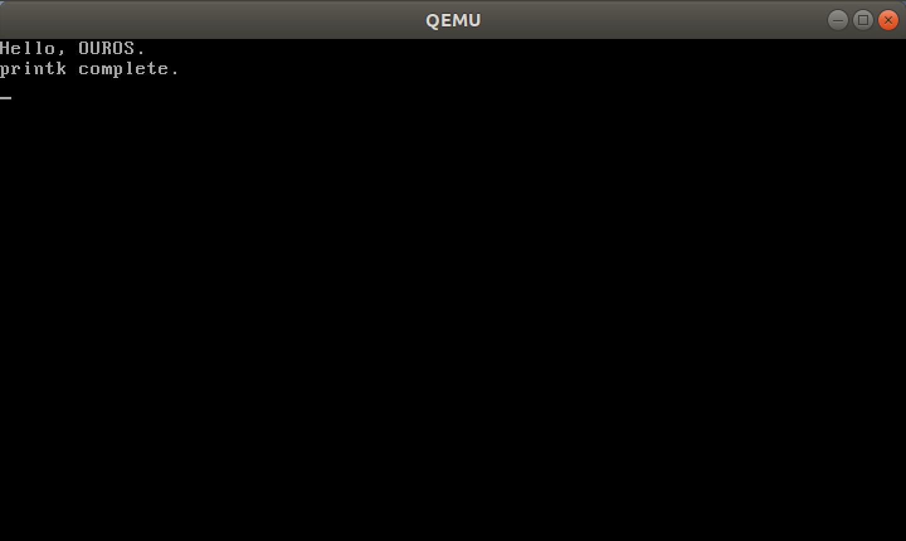

# OUROS-输出

为了输出方便，编写输出相关函数。

## 1 输出函数框架

函数框架：

```c
printk("Hello, OUROS\n");
```

希望通过该函数达到与下述代码相同的效果：

```c
uint8_t *input = (uint8_t *)0xB8000;
uint8_t color = (0 << 4) | (15 & 0x0F);

*input++ = 'H'; *input++ = color;
*input++ = 'e'; *input++ = color;
*input++ = 'l'; *input++ = color;
*input++ = 'l'; *input++ = color;
*input++ = 'o'; *input++ = color;
*input++ = ','; *input++ = color;
*input++ = ' '; *input++ = color;
*input++ = 'O'; *input++ = color;
*input++ = 'U'; *input++ = color;
*input++ = 'R'; *input++ = color;
*input++ = 'O'; *input++ = color;
*input++ = 'S'; *input++ = color;
*input++ = '.'; *input++ = color;
```

可以看到大大提高了效率。

如何输出到屏幕上与具体架构相关，所以将头文件创建在 `include/asm/stdio.h`。内容如下：

```c
// include/asm/stdio.h
#ifndef __LIB_STDIO_H
#define __LIB_STDIO_H

#include <asm/types.h>

typedef char* va_list;

extern int sprintf(char * buf, const char *fmt, ...);
extern int vsprintf(char *buf, const char *fmt, va_list args);
extern char* itoa(int num,char* dst,int radix);
extern char* uitoa(unsigned int num,char* dst,int radix);
extern void print_int(int num);
extern void print_hex(unsigned int num);
extern void put_char(char ch);
extern void printk(const char* format, ...);
extern void print_str(char *str);

#define va_start(ap, v) ap = (va_list)&v
#define va_arg(ap, t) *((t*)(ap += 4))
#define va_end(ap) ap = NULL

#endif
```

其中使用关键字 `extern` 的函数在文件 `lib/vsprintf.c` 和 `lib/stdio.c` 中。内容如下：

```c
// lib/stdio.c
#include <asm/stdio.h>
#include <linux/string.h>

void printk(const char* format, ...){
    va_list args;
    va_start(args, format);
    char buf[1024] = {0};
    vsprintf(buf, format, args);
    print_str(buf);
}
```

```c
// lib/vsprintf.c 部分内容
#include <asm/types.h>
#include <linux/string.h>
#include <linux/ctype.h>
#include <asm/div64.h>
#include <asm/stdio.h>

unsigned long simple_strtoul(const char *cp,char **endp,unsigned int base)
{
    unsigned long result = 0,value;

    if (!base) {
        base = 10;
        if (*cp == '0') {
            base = 8;
            cp++;
            if ((*cp == 'x') && isxdigit(cp[1])) {
                cp++;
                base = 16;
            }
        }
    }
    while (isxdigit(*cp) &&
           (value = isdigit(*cp) ? *cp-'0' : toupper(*cp)-'A'+10) < base) {
        result = result*base + value;
        cp++;
    }
    if (endp)
        *endp = (char *)cp;
    return result;
}
```

> lib/vsprintf.c 内容较多且为库函数，具体内容直接看源码即可。源码链接：https://gitee.com/wsljy2021/ouros

## 2 依赖函数

上述代码中就可以看到输出函数需要依赖一些库函数，现逐一解决。

> 具体代码框架设计仁者见仁，OUROS 更多是借鉴 Linux 的设计。

### 2.1 include/linux/string.h

字符串处理函数是必不可少的，所需函数如下所示：

```c
// include/linux/string.h
#ifndef _LINUX_STRING_H_
#define _LINUX_STRING_H_

#include <asm/types.h>

/* 将dst_起始的size个字节置为value */
extern void* memset(void* dst_, uint8_t value, uint32_t size);
/* 将src_起始的size个字节复制到dst_ */
extern void memcpy(const void* dst, const void* src, unsigned int size);

/* 连续比较以地址a_和地址b_开头的size个字节,若相等则返回0,若a_大于b_返回+1,否则返回-1 */
extern int memcmp(const void * s1, const void *s2, int n);

/* 将字符串从src_复制到dst_ */
extern char* strcpy(char* dst_, const char* src_);

/* 返回字符串长度 */
extern uint32_t strlen(const char* str);

/* 比较两个字符串,若a_中的字符大于b_中的字符返回1,相等时返回0,否则返回-1. */
extern int8_t strcmp (const char* a, const char* b);

/* 从左到右查找字符串str中首次出现字符ch的地址(不是下标,是地址) */
extern char* strchr(const char* str, const uint8_t ch);

/* 从后往前查找字符串str中首次出现字符ch的地址(不是下标,是地址) */
extern char* strrchr(const char* str, const uint8_t ch);

/* 将字符串src_拼接到dst_后,将回拼接的串地址 */
extern char* strcat(char* dst_, const char* src_);

/* 在字符串str中查找指定字符ch出现的次数 */
extern uint32_t strchrs(const char* str, uint8_t ch);

#define struct_cpy(x,y) 			\
({						\
	memcpy(x, y, sizeof(*(x)));		\
})

extern char* itoa(int num,char* dst,int radix);

extern char* uitoa(unsigned int num,char* dst,int radix);

extern uint32_t strnlen(const char* str, uint32_t max);

extern char * strstr(const char * s1,const char * s2);

extern int strncmp(const char * cs,const char * ct,size_t count);
#endif
```

具体实现在文件 `arch/i386/lib/string.c` 中。

```c
// arch/i386/lib/string.c 部分内容
#include <asm/types.h>
#include <linux/debug.h>

void memset(void* dst_, uint8_t value, uint32_t size) {
   if(dst_ == NULL) {
       BUG();
   }
   uint8_t* dst = (uint8_t*)dst_;
   while (size-- > 0)
      *dst++ = value;
}
```

> arch/i386/lib/string.c 内容较多且为库函数，具体内容直接看源码即可。源码链接：https://gitee.com/wsljy2021/ouros

该库函数依赖 `include/linux/debug.h`。内容如下：

```c
// include/linux/debug.h
#ifndef __KERNEL_DEBUG_H
#define __KERNEL_DEBUG_H

extern void panic_spin(char* filename, int line, const char* func);

/***************************  __VA_ARGS__  *******************************
 * __VA_ARGS__ 是预处理器所支持的专用标识符。
 * 代表所有与省略号相对应的参数. 
 * "..."表示定义的宏其参数可变.*/
#define PANIC() panic_spin (__FILE__, __LINE__, __func__)
 /***********************************************************************/

#define BUG() PANIC()

#endif /*__KERNEL_DEBUG_H*/
```

其中 `panic_spin` 函数如下所示：

```c
#include <asm/print.h>
#include <asm-i386/interrupt.h>
#include <asm/stdio.h>

/* 打印文件名,行号,函数名,条件并使程序悬停 */
void panic_spin(char* filename,
	        int line,
		const char* func)
{
//   intr_disable();	// 因为有时候会单独调用panic_spin,所以在此处关中断。
    printk("\n\n\n!!!!! error !!!!!\n");
    printk("filename:");printk("%s", filename);printk("\n");
    printk("line:0x");printk("%d",line);printk("\n");
    printk("function:");printk("%s", (char*)func);printk("\n");
   while(1);
}
```

> 这里好想循环调用了。

### 2.2 include/linux/ctype.h

> wiki：https://zh.wikipedia.org/wiki/Ctype.h

**`ctype.h`** 定义了一批C语言字符分类函数（C character classification functions），用于测试字符是否属于特定的字符类别，如字母字符、控制字符等等。既支持单字节字符，也支持宽字符。

现代的C库中，字符分类函数一般不用比较测试（comparison tests）实现，而是静态查表来实现。

例如，创建一个由256个8位宽整数组成的数组，每个整数的每位对应字符的特定的分类性质，如属于数字、属于字母等等。如果最低位表示属于数字性质，那么可以写成如下代码：

```c
#define isdigit(x) (TABLE[x] & 1)
```

```c
// include/linux/ctype.h
#ifndef _LINUX_CTYPE_H
#define _LINUX_CTYPE_H

/*
 * NOTE! This ctype does not handle EOF like the standard C
 * library is required to.
 */

#define _U	0x01	/* upper */
#define _L	0x02	/* lower */
#define _D	0x04	/* digit */
#define _C	0x08	/* cntrl */
#define _P	0x10	/* punct */
#define _S	0x20	/* white space (space/lf/tab) */
#define _X	0x40	/* hex digit */
#define _SP	0x80	/* hard space (0x20) */

extern unsigned char _ctype[];

#define __ismask(x) (_ctype[(int)(unsigned char)(x)])

#define isalnum(c)	((__ismask(c)&(_U|_L|_D)) != 0)
#define isalpha(c)	((__ismask(c)&(_U|_L)) != 0)
#define iscntrl(c)	((__ismask(c)&(_C)) != 0)
#define isdigit(c)	((__ismask(c)&(_D)) != 0)
#define isgraph(c)	((__ismask(c)&(_P|_U|_L|_D)) != 0)
#define islower(c)	((__ismask(c)&(_L)) != 0)
#define isprint(c)	((__ismask(c)&(_P|_U|_L|_D|_SP)) != 0)
#define ispunct(c)	((__ismask(c)&(_P)) != 0)
#define isspace(c)	((__ismask(c)&(_S)) != 0)
#define isupper(c)	((__ismask(c)&(_U)) != 0)
#define isxdigit(c)	((__ismask(c)&(_D|_X)) != 0)

#define isascii(c) (((unsigned char)(c))<=0x7f)
#define toascii(c) (((unsigned char)(c))&0x7f)

static inline unsigned char __tolower(unsigned char c)
{
    if (isupper(c))
        c -= 'A'-'a';
    return c;
}

static inline unsigned char __toupper(unsigned char c)
{
    if (islower(c))
        c -= 'a'-'A';
    return c;
}

#define tolower(c) __tolower(c)
#define toupper(c) __toupper(c)

#endif
```

```c
// lib/ctype.c
/*
 *  linux/lib/ctype.c
 *
 *  Copyright (C) 1991, 1992  Linus Torvalds
 */

#include <linux/ctype.h>

unsigned char _ctype[] = {
        _C,_C,_C,_C,_C,_C,_C,_C,			/* 0-7 */
        _C,_C|_S,_C|_S,_C|_S,_C|_S,_C|_S,_C,_C,		/* 8-15 */
        _C,_C,_C,_C,_C,_C,_C,_C,			/* 16-23 */
        _C,_C,_C,_C,_C,_C,_C,_C,			/* 24-31 */
        _S|_SP,_P,_P,_P,_P,_P,_P,_P,			/* 32-39 */
        _P,_P,_P,_P,_P,_P,_P,_P,			/* 40-47 */
        _D,_D,_D,_D,_D,_D,_D,_D,			/* 48-55 */
        _D,_D,_P,_P,_P,_P,_P,_P,			/* 56-63 */
        _P,_U|_X,_U|_X,_U|_X,_U|_X,_U|_X,_U|_X,_U,	/* 64-71 */
        _U,_U,_U,_U,_U,_U,_U,_U,			/* 72-79 */
        _U,_U,_U,_U,_U,_U,_U,_U,			/* 80-87 */
        _U,_U,_U,_P,_P,_P,_P,_P,			/* 88-95 */
        _P,_L|_X,_L|_X,_L|_X,_L|_X,_L|_X,_L|_X,_L,	/* 96-103 */
        _L,_L,_L,_L,_L,_L,_L,_L,			/* 104-111 */
        _L,_L,_L,_L,_L,_L,_L,_L,			/* 112-119 */
        _L,_L,_L,_P,_P,_P,_P,_C,			/* 120-127 */
        0,0,0,0,0,0,0,0,0,0,0,0,0,0,0,0,		/* 128-143 */
        0,0,0,0,0,0,0,0,0,0,0,0,0,0,0,0,		/* 144-159 */
        _S|_SP,_P,_P,_P,_P,_P,_P,_P,_P,_P,_P,_P,_P,_P,_P,_P,   /* 160-175 */
        _P,_P,_P,_P,_P,_P,_P,_P,_P,_P,_P,_P,_P,_P,_P,_P,       /* 176-191 */
        _U,_U,_U,_U,_U,_U,_U,_U,_U,_U,_U,_U,_U,_U,_U,_U,       /* 192-207 */
        _U,_U,_U,_U,_U,_U,_U,_P,_U,_U,_U,_U,_U,_U,_U,_L,       /* 208-223 */
        _L,_L,_L,_L,_L,_L,_L,_L,_L,_L,_L,_L,_L,_L,_L,_L,       /* 224-239 */
        _L,_L,_L,_L,_L,_L,_L,_P,_L,_L,_L,_L,_L,_L,_L,_L};      /* 240-255 */
```

### 2.3 include/asm-i386/dev64.h

```c
// include/asm-i386/dev64.h
#ifndef __I386_DIV64
#define __I386_DIV64

#define do_div(n,base) ({ \
	unsigned long __upper, __low, __high, __mod; \
	asm("":"=a" (__low), "=d" (__high):"A" (n)); \
	__upper = __high; \
	if (__high) { \
		__upper = __high % (base); \
		__high = __high / (base); \
	} \
	asm("divl %2":"=a" (__low), "=d" (__mod):"rm" (base), "0" (__low), "1" (__upper)); \
	asm("":"=A" (n):"a" (__low),"d" (__high)); \
	__mod; \
})

#endif
```

### 2.4 lib/kernel/lib.c

```c
// lib/kernel/lib.c
#include <asm/stdio.h>
#include <linux/string.h>
#include <asm/io.h>

/*
颜色生成方法
MAKE_COLOR(BLUE, RED)
MAKE_COLOR(BLACK, RED) | BRIGHT
MAKE_COLOR(BLACK, RED) | BRIGHT | FLASH
*/
#define TEXT_BLACK   0x0     /* 0000 */
#define TEXT_WHITE   0x7     /* 0111 */
#define TEXT_RED     0x4     /* 0100 */
#define TEXT_GREEN   0x2     /* 0010 */
#define TEXT_BLUE    0x1     /* 0001 */
#define TEXT_FLASH   0x80    /* 1000 0000 */
#define TEXT_BRIGHT  0x08    /* 0000 1000 */
#define	MAKE_COLOR(x,y)	((x<<4) | y) /* MAKE_COLOR(Background,Foreground) */

#define DISPLAY_VRAM 0xc00b8000

#define	CRTC_ADDR_REG	0x3D4	/* CRT Controller Registers - Addr Register */
#define	CRTC_DATA_REG	0x3D5	/* CRT Controller Registers - Data Register */
#define	START_ADDR_H	0xC	/* reg index of video mem start addr (MSB) */
#define	START_ADDR_L	0xD	/* reg index of video mem start addr (LSB) */
#define	CURSOR_H	    0xE	/* reg index of cursor position (MSB) */
#define	CURSOR_L	    0xF	/* reg index of cursor position (LSB) */
#define	V_MEM_BASE	    DISPLAY_VRAM	/* base of color video memory */

#define SCREEN_UP -1
#define SCREEN_DOWN 1

#define SCREEN_WIDTH 80
#define SCREEN_HEIGHT 25

#define COLOR_DEFAULT	(MAKE_COLOR(TEXT_BLACK, TEXT_WHITE))

int cursor_x = 0, cursor_y = 0;

void outsb(unsigned short port, const void * addr, unsigned long count)
{
    __asm__ __volatile__ ("rep ; outsb": "=S" (addr), "=c" (count) : "d" (port),"0" (addr),"1" (count));
}
```

> lib/kernel/lib.c 内容较多且为库函数，具体内容直接看源码即可。源码链接：https://gitee.com/wsljy2021/ouros

## 3 测试

在 `start_kernel` 函数中写入 `printk` 进行测试，测试如下：

```c
#include <asm/types.h>
#include <asm/stdio.h>

void start_kernel(void)
{
    printk("Hello, OUROS.\n");
    printk("printk complete\n");
}
```

使用的较为简单的makefile：

```makefile
#!Makefile

BUILD_DIR = ./build
C_SOURCES = $(shell find . -name "*.c")
C_OBJECTS = $(patsubst %.c, %.o, $(C_SOURCES))
S_SOURCES = $(shell find . -name "*.s")
S_OBJECTS = $(patsubst %.s, %.o, $(S_SOURCES))

CC = gcc
LD = ld
ASM = nasm

C_FLAGS = -I ./include/ -c -fno-builtin -m32 -fno-stack-protector -nostdinc -fno-pic -gdwarf-2
LD_FLAGS = -m elf_i386 -T ./script/kernel.ld -Map ./build/kernel.map -nostdlib
ASM_FLAGS = -f elf -g -F stabs

all: $(S_OBJECTS) $(C_OBJECTS) link update_image

.c.o:
	@echo 编译代码文件 $< ...
	$(CC) $(C_FLAGS) $< -o $@

.s.o:
	@echo 编译汇编文件 $< ...
	$(ASM) $(ASM_FLAGS) $<

link:
	@echo 链接内核文件...
	$(LD) $(LD_FLAGS) $(S_OBJECTS) $(C_OBJECTS) -o kernel.bin

.PHONY:clean
clean:
	$(RM) $(S_OBJECTS) $(C_OBJECTS) kernel.bin

.PHONY:update_image
update_image:
	sudo cp kernel.bin ./hdisk/boot/
	sleep 1

.PHONY:mount_image
mount_image:
	sudo mount -o loop ./hd.img ./hdisk/

.PHONY:umount_image
umount_image:
	sudo umount ./hdisk

.PHONY:qemu
qemu:
	qemu-system-i386 -serial stdio -drive file=./hd.img,format=raw,index=0,media=disk -m 512

.PHONY:debug
debug:
	qemu-system-i386 -serial stdio -S -s -drive file=./hd.img,format=raw,index=0,media=disk -m 512
	sleep 1
	gdb ./hd.img
```

```c
sudo make all
sudo make qemu
```



