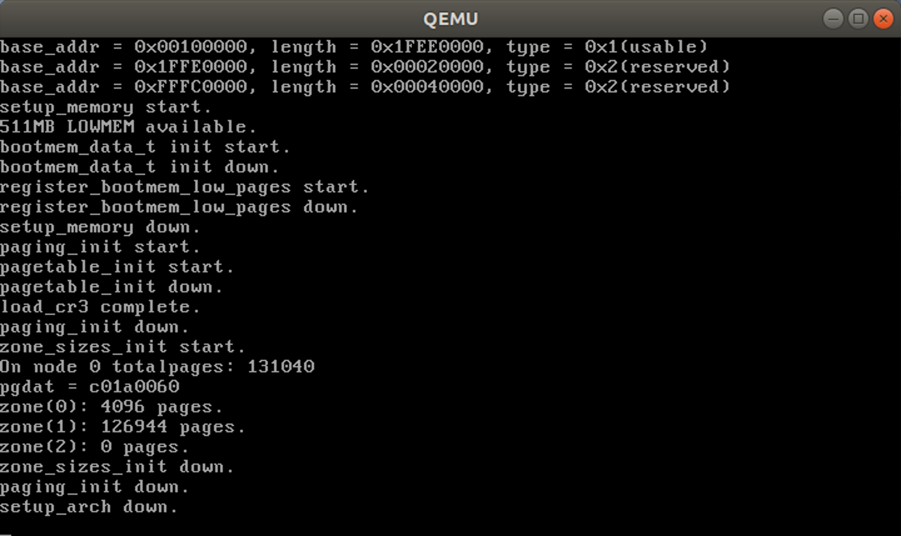

# register_memory()

## 1. probe_roms()

访问I/O端口非常简单，但是检测哪些I/O端口已经分配给I/O设备可能就没有那么简单了。通常I/O设备驱动程序为了探测硬件设备，需要盲目地想某一I/O端口写入数据，但如果其他硬件已经使用了这个端口，那么系统就会崩溃。为了防止这种情况的发生，内核使用“资源”来记录分配给每个硬件设备的I/O端口。

资源表示某个实体的一部分，这部分被互斥地分配给设备驱动程序。一个资源表示I/O端口地址的一个范围。每个资源对应的信息存放在 `resource` 数据结构中。所有的同种资源都插入到一个树形数据结构中，例如表示I/O端口地址范围的所有资源都包含在一个跟节点伟 `ioport_resource` 的树中。

```c
struct resource {
    const char *name; 							 // 资源拥有者的描述
    unsigned long start, end;                    // 资源范围的开始和结束
    unsigned long flags;   						 // 各种标志
    struct resource *parent, *sibling, *child;   // 指向资源数中父亲、兄弟、第一个孩子的指针
};
```

* request_resource()

  把一个给定范围分配给一个I/O设备。

* allocate_resource()

  在资源树中寻找一个给定大小和排列方式的可用范围。若存在，就将这个范围分配给一个I/O设备。

* release_resource()

  释放以前分配给I/O设备的给定范围。

在 `probe_roms()` 中会用到 `request_resource()` 函数。该函数的代码如下所示。

```c
// kernel/resource.c - request_resource()
/**
 * request_resource - 把一个给定范围分配给一个 I/O 设备
 * @root: 资源树根节点
 * @new:  要插入的新资源数据结构的地址
 * **/
int request_resource(struct resource *root, struct resource *new)
{
	struct resource *conflict;
	write_lock(&resource_lock);
	conflict = __request_resource(root, new);
    write_unlock(&resource_lock);
    return conflict ? -EBUSY : 0;
}
```

首先使用读写锁对“资源”上锁。然后调用 `__request_resource()` 函数。`__request_resource()` 函数代码如下所示。

```c
/* Return the conflict entry if you can't request it */
/* 如果无法请求，返回冲突条目 */
static struct resource * __request_resource(struct resource *root, struct resource *new)
{
	unsigned long start = new->start;   // 获得要插入节点的起始值
	unsigned long end = new->end;       // 获得要插入节点的结束值
	struct resource *tmp, **p;

    // 做一些合法性检查
	if (end < start)
		return root;
	if (start < root->start)
		return root;
	if (end > root->end)
		return root;
	p = &root->child;   // 获得根节点的孩子链表地址
	for (;;) {
		tmp = *p;
		if (!tmp || tmp->start > end) {
			new->sibling = tmp;
			*p = new;
			new->parent = root;
			return NULL;
		}
		p = &tmp->sibling;
		if (tmp->end < start)
			continue;
		return tmp;
	}
}
```

`probe_roms()` 函数调用 `request_resource()` 的方式如下。

```c
request_resource(&iomem_resource, rom_resources+0);
```

`iomem_resource` 的定义如下。

```c
// kernel/resource.c
struct resource iomem_resource = { "PCI mem", 0x00000000, 0xffffffff, IORESOURCE_MEM };
// include/linux/ioport.h
#define IORESOURCE_MEM		0x00000200
```

`rom_resources` 的定义如下。

```c
// arch/i386/kernel/setup.c
/* System ROM resources */
#define MAXROMS 6
static struct resource rom_resources[MAXROMS] = {
	{ "System ROM", 0xF0000, 0xFFFFF, IORESOURCE_BUSY },
	{ "Video ROM", 0xc0000, 0xc7fff, IORESOURCE_BUSY }
};
// include/linux/ioport.h
#define IORESOURCE_BUSY		0x80000000	/* Driver has marked this resource busy */
```

`probe_roms()` 函数的代码如下。

```c
// arch/i386/kernel/setup.c - probe_roms()

#define romsignature(x) (*(unsigned short *)(x) == 0xaa55)

static void probe_roms(void)
{
	int roms = 1;
	unsigned long base;
	unsigned char *romstart;

	request_resource(&iomem_resource, rom_resources+0);

	/* Video ROM is standard at C000:0000 - C7FF:0000, check signature */
	for (base = 0xC0000; base < 0xE0000; base += 2048) {
		romstart = bus_to_virt(base);   // 将已经映射的物理内存地址转换为虚拟地址
		if (!romsignature(romstart))
			continue;
		request_resource(&iomem_resource, rom_resources + roms);
		roms++;
		break;
	}

	/* Extension roms at C800:0000 - DFFF:0000 */
	for (base = 0xC8000; base < 0xE0000; base += 2048) {
		unsigned long length;

		romstart = bus_to_virt(base);
		if (!romsignature(romstart))
			continue;
		length = romstart[2] * 512;
		if (length) {
			unsigned int i;
			unsigned char chksum;

			chksum = 0;
			for (i = 0; i < length; i++)
				chksum += romstart[i];

			/* Good checksum? */
			if (!chksum) {
				rom_resources[roms].start = base;
				rom_resources[roms].end = base + length - 1;
				rom_resources[roms].name = "Extension ROM";
				rom_resources[roms].flags = IORESOURCE_BUSY;

				request_resource(&iomem_resource, rom_resources + roms);
				roms++;
				if (roms >= MAXROMS)
					return;
			}
		}
	}

	/* Final check for motherboard extension rom at E000:0000 */
	base = 0xE0000;
	romstart = bus_to_virt(base);

	if (romsignature(romstart)) {
		rom_resources[roms].start = base;
		rom_resources[roms].end = base + 65535;
		rom_resources[roms].name = "Extension ROM";
		rom_resources[roms].flags = IORESOURCE_BUSY;

		request_resource(&iomem_resource, rom_resources + roms);
	}
}
```

`setup_arch()` 函数调用 `register_memory()` 函数请求标准 RAM 和 ROM 资源的空间。其中就会调用 `probe_roms()` 函数。

```c
// arch/i386/kernel/setup.c - register_memory()

#define STANDARD_IO_RESOURCES (sizeof(standard_io_resources)/sizeof(struct resource))

static struct resource code_resource = { "Kernel code", 0x100000, 0 };
static struct resource data_resource = { "Kernel data", 0, 0 };
static struct resource vram_resource = { "Video RAM area", 0xa0000, 0xbffff, IORESOURCE_BUSY };

/*
 * Request address space for all standard RAM and ROM resources（请求所有标准RAM和ROM资源的地址空间）
 * and also for regions reported as reserved by the e820.（也适用于e820 报告的区域。）
 */
static void register_memory(unsigned long max_low_pfn)
{
	unsigned long low_mem_size;
	int i;
	probe_roms();
	for (i = 0; i < e820.nr_map; i++) {
		struct resource *res;
		if (e820.map[i].addr + e820.map[i].size > 0x100000000ULL)
			continue;
		res = alloc_bootmem_low(sizeof(struct resource));
		switch (e820.map[i].type) {
		case E820_RAM:	res->name = "System RAM"; break;
		case E820_ACPI:	res->name = "ACPI Tables"; break;
		case E820_NVS:	res->name = "ACPI Non-volatile Storage"; break;
		default:	res->name = "reserved";
		}
		res->start = e820.map[i].addr;
		res->end = res->start + e820.map[i].size - 1;
		res->flags = IORESOURCE_MEM | IORESOURCE_BUSY;
		request_resource(&iomem_resource, res);
		if (e820.map[i].type == E820_RAM) {
			/*
			 *  We dont't know which RAM region contains kernel data,
			 *  so we try it repeatedly and let the resource manager
			 *  test it.
			 */
			request_resource(res, &code_resource);
			request_resource(res, &data_resource);
		}
	}
	request_resource(&iomem_resource, &vram_resource);

	/* request I/O space for devices used on all i[345]86 PCs */
	for (i = 0; i < STANDARD_IO_RESOURCES; i++)
		request_resource(&ioport_resource, standard_io_resources+i);

	/* Tell the PCI layer not to allocate too close to the RAM area.. */
	low_mem_size = ((max_low_pfn << PAGE_SHIFT) + 0xfffff) & ~0xfffff;
	if (low_mem_size > pci_mem_start)
		pci_mem_start = low_mem_size;
}
```

最后在 `setup_arch()` 函数中加入提示信息。完整代码如下所示。

```c
void setup_arch(void)
{
	printk("setup_arch start.\n");
	unsigned long max_low_pfn;
	
	printk("kernel in memory start: 0x%08X\n", &_start);
    printk("kernel in memory end:   0x%08X\n", &_end - 0xc0000000);
    printk("kernel in memory used:   %d KB\n\n", (&_end - 0xc0000000 - &_start + 1023) / 1024);

	show_memory_map();
	setup_memory_region();
	max_low_pfn = setup_memory();
	// printk("max_low_pfn = %x\n", max_low_pfn);
	paging_init();
	register_memory(max_low_pfn);
	printk("setup_arch down.\n");
}
```

编译链接，然后运行。运行截图如下所示。


